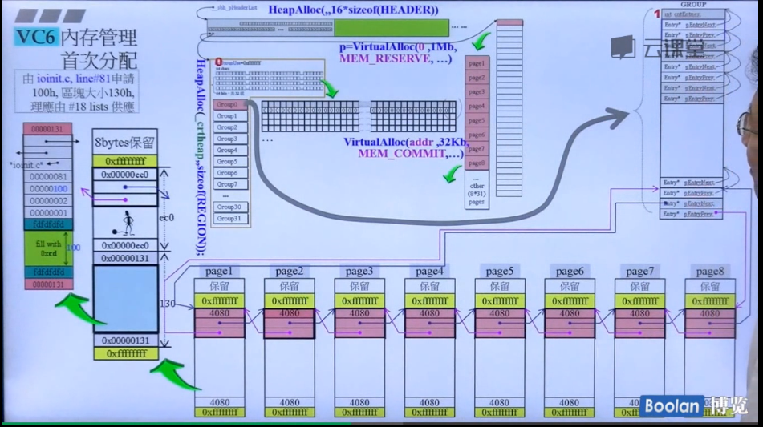

```c
//HeapAlloc拿去的region。
struct tagRegion{
    int indGroupUse;
    char cntRegionSize[64]
    BITVEC bitvGroupHi[32]
    BITVEC bitvGroupLo[32]
    struct tagGroup grpHeadList[32]
//1M
}

struct tagGroup{
    int cntEntries;
    struct tagListHead listHead[64];
//32k
}
//将32k，初始的时候，先分为8个page，是4k，先挂载在64链表的最后一个链表。
struct tagListHead{
    struct tagEntry* pEntryNext;
    struct tagEntry* pEntryPre;

//每一条双向链表管理的内存块大小是不一样的，以16字节递增
}
struct tagEntry{
    int sizeFront;
    struct tagEntry* pEntryNext;
    struct tagEntry* pEntryPre;
//最后一条链表管理的大小最小是1k，如果小于1k，那就由其他的双向链表来管理。。
}
```
