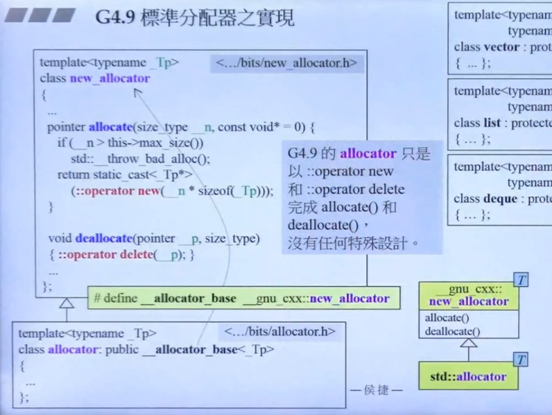

## VC标准分配器之实现
```c++
class allocator{
public:
    typedef __size size_type
    ...
    pointer allocate(){}
    void deallocate(){}
}
//VC6+的allocator只是以::operator new和::operator delete完成allocate（）和deallocate（）

```

## GNUC标准分配器之实现

