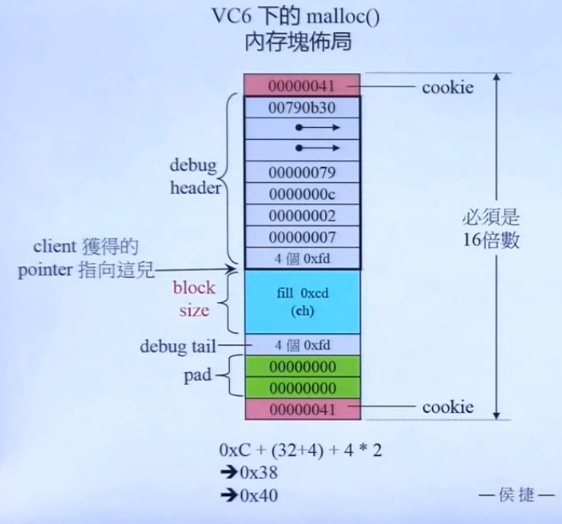
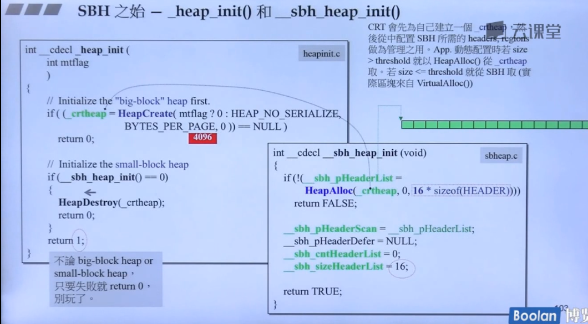
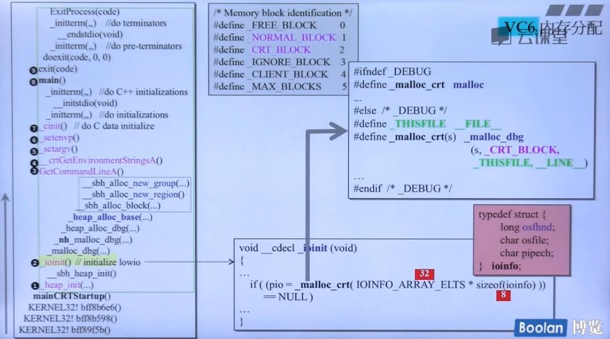

海量小区块，cookie的浪费不能接受。

malloc和free是c语言层次的东西。

C++程序进入main之前的情形:
mainCRTStartup()
1. heap_init()
2. \_ioinit()
3. GetCommandLineA()
4. \_crtGetEnvironmentStringsA()
5. \_setargv()
6. \_setenvp()
7. \_cinit()//C data initialize



## heap_init
里面分了16个Header
## \_ioinit


```
#ifndef _DEBUG
#define malloc_crt malloc
...
#else
#define malloc_crt malloc_dbg
```
而ioinit里面就调用了_malloc_crt这个函数
## heap_alloc_dbg
映像：
- malloc分配的所有的内存块都被统统登记（SBH），通过链表来进行存起来的。
- 两根指针指向头尾。

调用memset来填一些值，如果内存块被填充的设置为oxFD，oxDD，oxC0。
## heap_alloc_base
刚扩充的大小，来进行比较，如果比较小就交给SBH，否则就交给操作系统。
- 即调用sbh_alloc_block函数，调整到16的倍数。
- sbh_alloc_new_region()函数
- sbh_alloc_new_group()函数。

## sbh_alloc_block
调整到16的倍数，然后最后加一位bit来表示是否被分配出去，1表示别分配出去了。
## sbh_alloc_new_region
总共16个Header，每一个Header负责管理1M的内存空间。怎么管理？new一个region。
region有bit，bytes，32个group：
- 两个指针，一个指向真正的内存区域，另一个指向管理中心。64bit的向量表示在链表里面存不存在。
## sbh_alloc_new_group
一个Group，有64个listHead，每个两根指针，总共64根双向链表。

==为了好好管理内存，浪费了16k的大小。==
