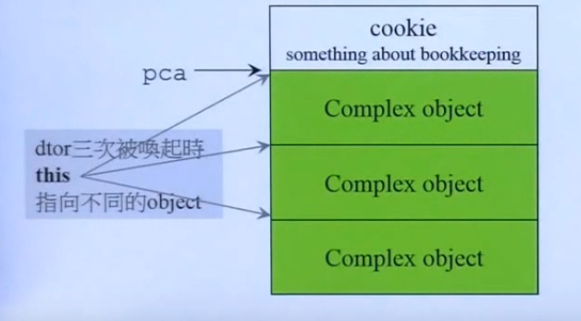
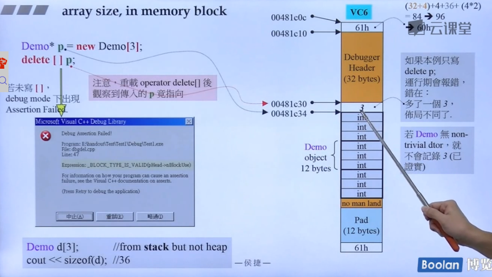
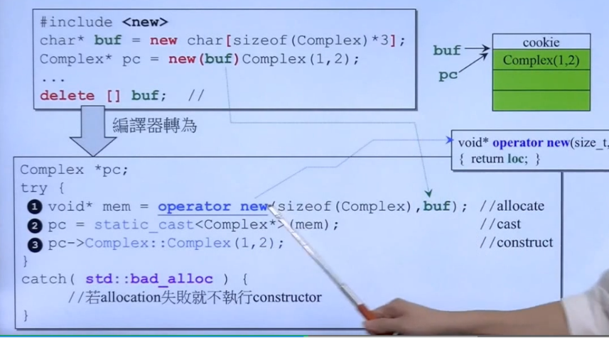

new的三把大刀，本身是一个表达式，调用形式。
- 一般的new，即new expression
- array new
- placement new
## new的理解
后面是class的类型，先分配一块内存，先分配内存，再调用构造函数。
==后面必须跟随对象类型==
`complex* pc = new complex(1,2);`
- void* mem= operator new（sizeof(complex)）：先分配内存,其实动作相当于malloc
- pc = static_cast<complex*>(mem)：指针转型
- pc->complex::complex(1,2)：不能直接调用构造函数，只有编译器才可以这样。

## delete的理解
- 先调用析构函数
- 然后把内存释放掉
## array new delete的理解

```c++
complex* pca = new complex[3]
delete[] pca;//调用3次析构函数，如果不带中括号，只调用一次析构函数。
//内存泄漏的情况。
```

array new的对象必须有默认构造函数。
## placement new
不会调用malloc函数
- placement new允许我们将object建构在allocated memory（已经分配的内存）中。可以调用构造函数。
- 没有所谓placement delete，因为placement new根本没有分配内存。
如上图，operator new重载函数，多了一个第二参数。
```c++
#incllude<new>
char* buf = new char[size];
complex* pc = new(buf)complex(1,2);//placement的调用形式。
...
delete [] buf;
```
```c
complex* pc
try{
    void* me = operator new(size,buf);//并没有分配内存
    pc = static_cast<complex*>(mem);
    pc->complex::complex(1,2);
}
catch(std::bad_alloc){

}
```
