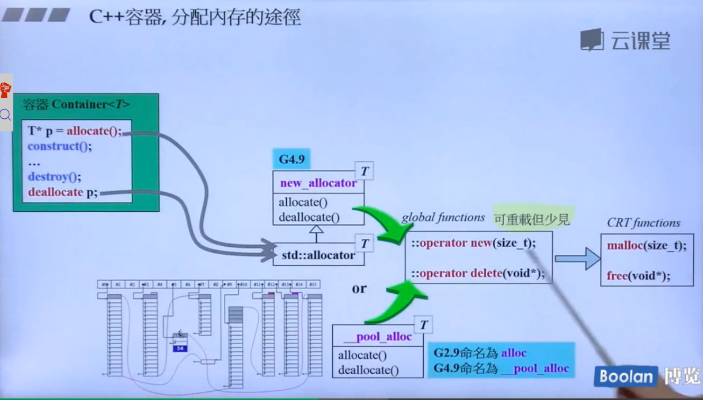

## per-class allocator
内存池的设计原则
- 降低malloc的调用次数，malloc只调用一次，然后多次的new。
- 降低cookie的占用量，或者去除cookie。（如果没有重载operator new/delete函数，那么就会自动调用全局的operator new/delete）

使用new去分配内存。
## per-class allocator2
第二个版本
使用operator new去分配内存。
使用union来借用前四个字节当做一个指针来使用。
## Static allocator
受困于必须为不同的classes重写一遍几乎相同的member operator new和member operator delete时，应该有方法抽取出来，抽象出来，放在一个allocator对象中。
`static allocator myAlloc`
专门为类A服务。
设计Foo的人，不用管理考虑内存管理的事情。
