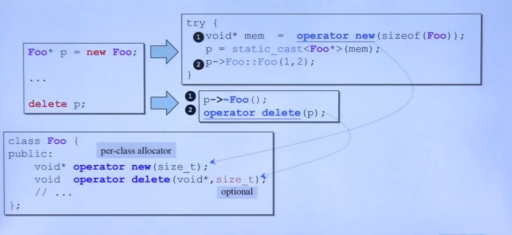

- new operator： 是一个关键字，用作调用。调用operator new分配足够的空间，并调用相关的构造函数。
- operator new ：操作符重载的函数定义，只分配所要求的空间，不调用相关对象的构造函数，可以被重载，返回类型必须为void*，重载时第一参数必须为size_t，可以带其他参数。
- placement new ： 是一个调用形式，用作调用，不会调用malloc。只是将对象建构与已经分配好的内存之中。
## 重载new的operator new定义函数
为什么要使用静态成员函数，因为这样在调用的时候，就不需要必须使用对象实例来调用，而是通过类名来调用，因为生成实例的过程中，实例还没有生成，所以只能由类名来进行调用。
==底层调用malloc和free==


```c
定义一个类，然后重载其operator new 函数。
static void* operator new()
static void operator delete()
static void* operator new[]()
static void operator delete()
```
#### 重载operator new[] / operator delete[]


#### 使用全局作用域，绕过重载的operator new/delete 函数
```c
Foo* p= ::new Foo(7);
::delete p;
```
## 重载placement new的operator new定义函数
带着小括号的就叫做placement new，可以重载写出多个版本，前提是参数列不同，==即多了一个第二参数==，第一参数必须是size_t
```c
void* operator new(size_t){}
void* operator new(size_t,void* start){}
void* operator new(size_t,long extra){}
void* operator new(size_t,long extra,char init){}
```
