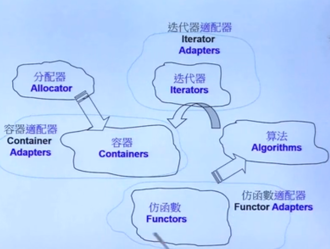

 背景：在讲解iterator时，我们使用iterator来达到了find操作的扩展性，使其可以对list，vector，array等操作，但是还是存在一个问题：find的实现使用了底部元素所属类型的\==运算符。如果底部元素所属类型并未提供这个运算符，或是用户希望赋予\==运算符不同的意义，这个find的弹性就不足了。如何才能增加其弹性？
- 解法之一是传入一个函数指针取代原本的固定使用的==运算符
- 运用所谓的function object，仿函数（函数对象）
- ==也就是增加弹性，将比较运算符也当做参数传递给泛型算法，并且函数都是实现好的，只需要函数都变为函数对象了，直接将函数对象作为一个对象传入泛型算法函数中，只需要调用就行==
## 概念
所谓仿函数是一个定义了operator()操作符重载的==对象==。
仿函数可以视为一般函数，不同之处在于：仿函数的功能在其成员函数operator()中实现的。

STL所提供的的各种算法，往往有两个版本，其中一个版本表现出最常用的某种运算，第二个版本则表现出最泛化的演算流程，允许用户以“template参数”来指定所要采取的策略。距离sort操作，第一版本是以operator< 为排序时的元素位置调整依据，第二版本则允许用户指定任何操作，务求排序后两两相邻元素都能令操作结果为true。

实现上述办法就是将操作设计为一个函数，再将函数指针当做算法的一个参数；或者将该操作设计为一个所谓的仿函数，再依该仿函数产生一个对象，并以此对象作为算法的一个参数。
## functors
可以自己写一些与标准库搭配使用到的，只服务于算法。

- ==对象必须重载()符号==
- ==对象还必须必须重载算术类，逻辑类，相对关系类的符号==

#### 内置仿函数的类型
以操作数的个数划分，可分为一元和二元仿函数。若依功能划分，则分为算术，关系，逻辑三大类。
标准库事先定义了一组function object，分为算术运算符，关系运算符合逻辑运算符三大类
- 六个算术运算符：plus,minus,negate,multiplies,divides,moudles

- 六个关系运算符：less，less_equal，greater，greater_equal，equal_to,not_equal_to
`sort(iv.begin(),iv.end,greater<int>())`
- 三个逻辑运算：与或非

#### 使用示例
```c++
//第一个版本，缺省采用元素型别所提供的equality操作符进行比较大小。
template<class Iterator1,class Iterator2>
inline bool equal(Iterator1 first1,Iterator1 last1,Iterator2 first2)
{
    for(..)
        if(*first1!=*first2)
            return false;
    return true;
}
//第二个版本，允许我们指定仿函数pred最为比较依据。
template<class Iterator1,class Iterator2,class Binarypred>
inline bool equal(Iterator1 first1,Iterator1 last1,Iterator2 first2,Binarypred binary_pred)
{
    for(..)
        if(!binary_pred(*first1,*first2))
            return false;
    return true;
}
```
## 仿函数的基类
空的基类，类没有任何的成员函数和成员变量，仅仅包含型别信息。

```c
{
template<class Arg,class Result>
struct unary_function{
  。。。
}
```

也是一个空类，该类的存在使Adaptable Binary Function models的定义更方便。

```c
{
  template<clss Arg1,calss Arg2,class Result>
struct binary_function{
}
```
## 仿函数的三个概念
- ==生成器==：不用参数就可以调用的仿函数
- 一元函数：使用一个参数就可以调用的函数
- 二元函数：两个参数才可以调用的函数

## 仿函数的作用
- 作为排序规则
- 拥有内部状态
- 算法for_each（）的返回值
- 作为判断式
