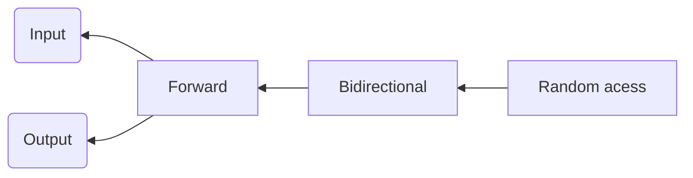

迭代器是一个行为类似于指针的模板类对象，可以是所需的任意类型，它最大的好处就是可以使得容器和算法分离。

不同的容器完成相同功能的代码的大体思路是相同的，那么能不能把它们抽象出来，多个容器仅对应一个显示，一个查询，一个排序函数呢？

这就是泛型思维发展的必然结果，于是迭代器思维就产生了。
## 进一步理解
每一个容器都有相应的迭代器，容器通过迭代器共享某一具体算法，某一具体算法不依附于某一具体容器。迭代器起到了一个中间媒介的作用，通过它把不同容器和同一算法关联起来！

通常或使用迭代器来定义一段元素，这些元素可能是容器中的对象，或是标准数组中的元素，或是字符串中的字符。一段元素通过一个起始迭代器指向第一个元素，通过结束迭代器指向最后一个元素。

函数模板处理的数据序列由迭代器作为参数指定，这部分工作就像是从数组中读取数据。

## 获取迭代器
可以通过调用容器的begin和end函数来获取容器的迭代器。
迭代器允许一种逐步自增的方式从一个元素移动到另一个元素
## 迭代器类型
迭代器的层次类型,不同的迭代器类型可以回答算法的不同的提问问题。

- 输入迭代器
按顺序只读访问，输入迭代器只能单个使用，迭代器自增后，不能访问上一个它所指定的元素。重载*，==，!=，++操作
- 输出迭代器
按顺序只写访问，性质和输入相同。重载*，=，++操作
- 前向迭代器
同时具备输入输出迭代器的功能，单向，但是可以使用多次，可以进行随意多次的读或写操作。
单向链表的迭代器。
- 双向迭代器
具备前向迭代器的功能，但是还具备前向或后向遍历，重载 ==--== 操作，双向链表容器需要双向迭代器。everse函数的迭代器参数类型
list，set，map的迭代器类型。
- 随机访问迭代器
具有双向迭代器的功能，再加上指针的所有的功能。包括使用操作符[ ] 进行索引，指针与数值运算（+ - 重载）等等。
deque，array，vector的迭代器。
## 迭代器适配器
- 逆向迭代器
- 插入迭代器

名称|class|调用的函数|生成函数
--|--|--|--|
| BackInserter  | back_insert_iterator | push_back  | back_inserter  |
| FrontInserter | front_insert_itertor | push_front | front_inserter |
GeneralInserter|insert_iterator|Insert|Inserter
- 流迭代器

## 迭代器
==stack，queue，priority_queue容器不支持迭代器==
支持的容器元素为：
- vector
- list
- map
- multimap
- set
- multiset

用法：auto start= V.begin();	auto end  = V.end()
> Written with [StackEdit](https://stackedit.io/).
<!--stackedit_data:
eyJoaXN0b3J5IjpbLTEwOTAxNTk1MzAsNDc0Mjk5ODU2LC0xMj
EwMzk4MTQ1XX0=
-->
