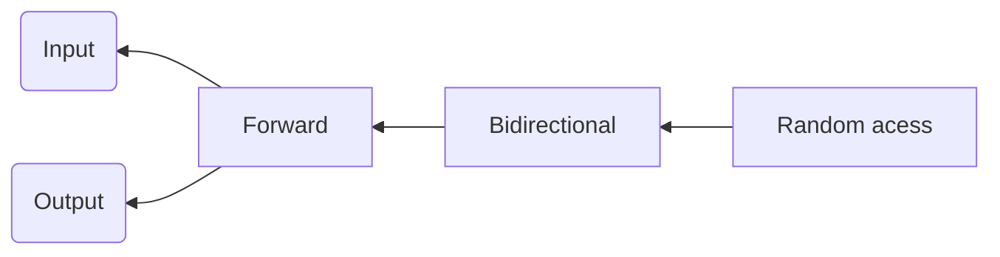

迭代器是一个行为类似于指针的模板类对象，可以是所需的任意类型，它最大的好处就是可以使得容器和算法分离。

不同的容器完成相同功能的代码的大体思路是相同的，那么能不能把它们抽象出来，多个容器仅对应一个显示，一个查询，一个排序函数呢？

这就是泛型思维发展的必然结果，于是迭代器思维就产生了。
## 迭代器是一种智能指针
迭代器是一种行为类似指针的对象，即实现了指针所局别的操作，而指针最常见的操作就是内容提领（operator \*）和成员访问(operator->)，所以迭代器最重要的编程工作就是对operator \*和operator->进行重载工作。

除此之外，迭代器还可以进行++，--，+x，-x等操作。
## 了解Iterator
很显然，这个抽象如何实现？我们需要提供一组对象，可提供有如内置运算符（++，\*，==，!=）【对迭代器本身进行运算符的重载】一般的运算符，并允许我们只为这些运算符提供一份实现即可。我们可以利用C++的类的机制来达到目的。

比如有first和last两个迭代器对象（当做指针）。唯一的差别在于其dereference运算，不等于运算，递增运算仍是iterator class内相关的inline函数提供。
- 对于list 迭代器而言，递增函数会沿着list的指针前进到下一个元素
- 对于vector迭代器而言，其递增函数前进至下一个元素的方式，是将目前的地址加上一个元素的大小。

## 如何获取迭代器
如何获取迭代器》每个标准容器都提供一个名为begin的函数，可返回一个iterator，指向第一个元素。
另一个名为end（）的操作函数会返回一个iterator，指向最后一个元素得到位置。

迭代器的定义需要哪些信息：
- 迭代对象的类型，这可用来决定如何访问下一个元素
- iterator所指向的元素类型，这可决定iterator提领操作的返回值
## 迭代器类型
迭代器的层次类型,不同的迭代器类型可以回答算法的不同的提问问题。

- 输入迭代器
按顺序只读访问，输入迭代器只能单个使用，迭代器自增后，不能访问上一个它所指定的元素。重载*，==，!=，++操作
- 输出迭代器
按顺序只写访问，性质和输入相同。重载*，=，++操作
- 前向迭代器
同时具备输入输出迭代器的功能，单向，但是可以使用多次，可以进行随意多次的读或写操作。
单向链表的迭代器。
- 双向迭代器
具备前向迭代器的功能，但是还具备前向或后向遍历，重载 ==--== 操作，双向链表容器需要双向迭代器。everse函数的迭代器参数类型
list，set，map的迭代器类型。
- 随机访问迭代器
具有双向迭代器的功能，再加上指针的所有的功能。包括使用操作符[ ] 进行索引，指针与数值运算（+ - 重载）等等。
deque，array，vector的迭代器。
## 迭代器适配器
- 逆向迭代器
- 插入迭代器

名称|class|调用的函数|生成函数
--|--|--|--|
| BackInserter  | back_insert_iterator | push_back  | back_inserter  |
| FrontInserter | front_insert_itertor | push_front | front_inserter |
GeneralInserter|insert_iterator|Insert|Inserter
- 流迭代器

## 迭代器
==stack，queue，priority_queue容器不支持迭代器==
支持的容器元素为：
- vector
- list
- map
- multimap
- set
- multiset

用法：auto start= V.begin();	auto end  = V.end()
> Written with [StackEdit](https://stackedit.io/).
<!--stackedit_data:
eyJoaXN0b3J5IjpbLTEwOTAxNTk1MzAsNDc0Mjk5ODU2LC0xMj
EwMzk4MTQ1XX0=
-->
