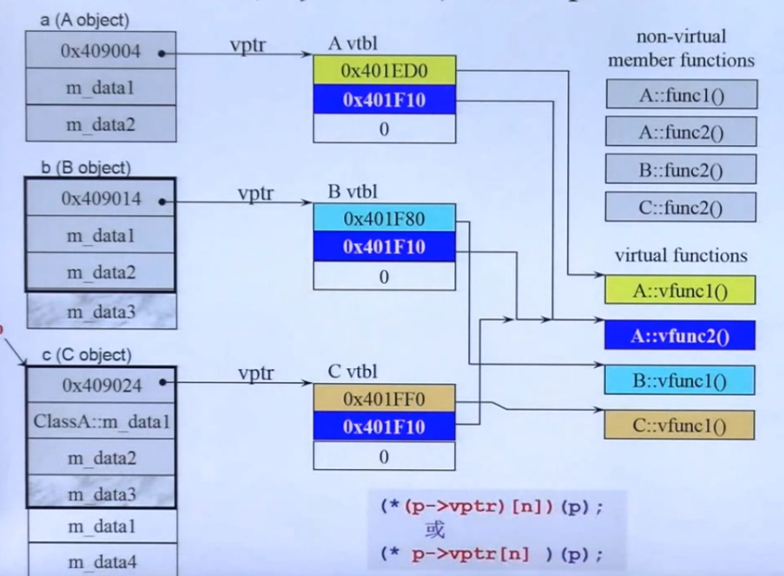

虚指针指向虚函数表

只要有虚函数，对象的内存就会多存放一个指针，不论虚函数的数量是多少，指针就只有一个。

这个指针就指向虚函数表，然后虚函数表里存放着函数指针。函数指针指向重载实现的虚函数。

==C++中，为了使容器内的可以容纳各式各样的形状，在容器指定时候放的是指针，容器不可以放大小不同的元素。==

可以声明一个指针的容器，然后指针是基类的指针，指针可以指向所有的派生类。遍历指针，然后指针可以调用所有的子类的特定虚函数。

所以多态一般是指基类指针的多态，即极基类指针指向不同的物体，但是又都属于同一大类。
## 动静态绑定的形式
C++编译器看到一个函数调用，有两个考量是把它进行静态绑定还是进行动态绑定。
静态绑定就是`call xxxx`；
动态绑定的条件：
- 必须通过指针来调用
- 指针向上转型，基类指针
- 调用的是虚函数。
动态绑定的调用形式：
`(*(p->vptr)[n])(p)`
或者
`(* p->vptr[n])(p)`
