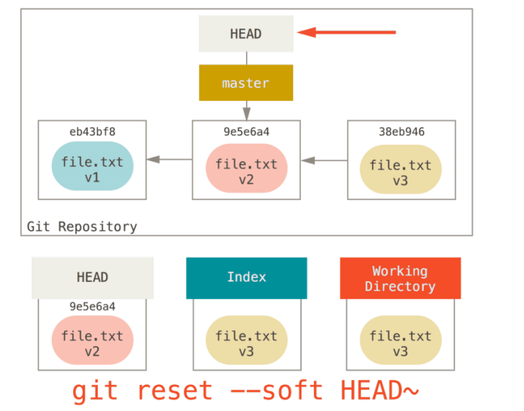
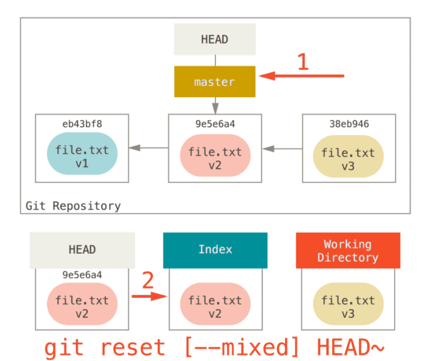
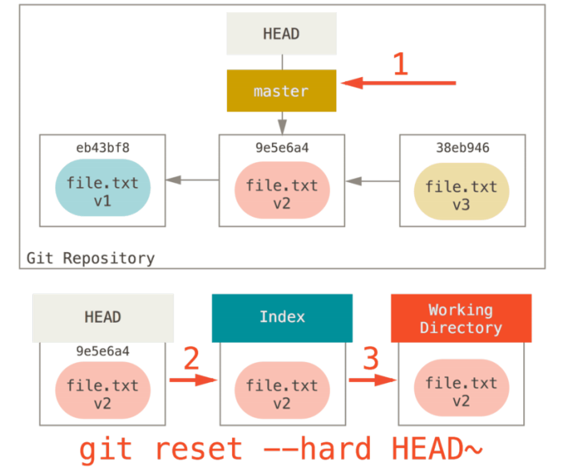
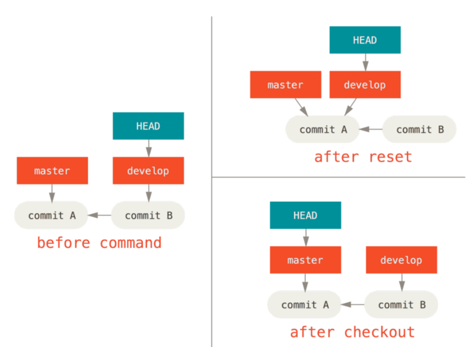

==对于未跟踪的文件夹和文件以下的两个操作不会有影响==

以下用HEAD是指代当前分支，索引指代暂存区，工作目录代表工作目录。
## git reset 的用法
- 移动分支的HEAD
`git reset <HEAD>`
从缓存区移除特定文件，但不改变工作目录。它会取消这个文件的缓存，而不覆盖任何更改。

- 更新索引
`git reset --mixed`
reset会用HEAD指向的当前快照的内容更新索引。
但是不会改变工作区的内容。

- 改变索引和工作区
`git reset --hard`
将HEAD指向的快照覆盖索引，工作区。

#### 通过制定路径来重置
前面描述了reset基本的形式，不过你还可以给它提供一个作用路径。指定一个路径可以将它的范围限定为制定的文件或文件集合。

假如我们运行git reset file.txt（这其实是 git reset --mixed HEAD file.txt 的简写形式，因为你既没有指定一个提交的 SHA-1 或分支，也没有指定 --soft 或 --hard）,它本质上只是将file.txt从HEAD复制到索引当中，有取消暂存的作用。
## 检出
git checkout 和reset也一样，checkout也操纵三棵树，不过它有一点不同，这取决于是否给该命令一个文件路径。
#### 不带路径
这使得和git reset --hard非常相似，更新三棵树。但是它不会将已经更改的文件弄丢，还尝试简单合并一下

第二个区别就是git checkout只是变化HEAD的指向，不会对分支进行操作，但是git reset会将分支的最新分支的快照改变。
#### 带路径
这就会向reset一样不会移动HEAD，它就像git reset [branch] file那样用该次提交的那个文件来更新索引，但是它会覆盖工作目录中对应的文件
#### 变换的主体是工作区和暂存区
```
git checkout .
git checkout -- [file]
```
当执行  `git checkout .`  或者  `git checkout -- [file]`  命令时，会用==暂存区==全部或指定的文件替换==工作区==的文件。这个操作很危险，会清除工作区中未添加到暂存区的改动。

#### 变换的主体是（版本库）与（暂存区，工作区）
```
git checkout HEAD .
git checkout HEAD [file]
```
当执行 `git checkout HEAD .` 或者 `git checkout HEAD [file]` 命令时，会用 `HEAD` 指向的 `master` 分支中的全部或者部分文件替换暂存区和以及工作区中的文件。这个命令也是极具危险性的，因为不但会清除工作区中未提交的改动，也会清除暂存区中未提交的改动。


> Written with [StackEdit](https://stackedit.io/).
<!--stackedit_data:
eyJoaXN0b3J5IjpbMzg0MzE1MDEsMTU3MTc4Mzc2MywtMTc1ND
U5NzU3LDEyNjMzNzI1MDcsNTA0OTg5OTIxLDEwOTc2NTgyNjQs
MjEwODU2Mjc4OSwxMzgwOTM1OTk5LDE0MjQ5NDY1NzIsLTIwNj
YwNTEwNTNdfQ==
-->
