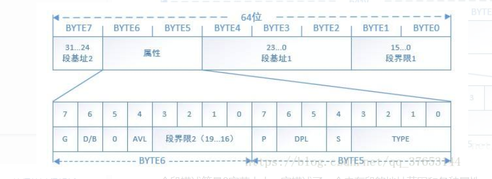
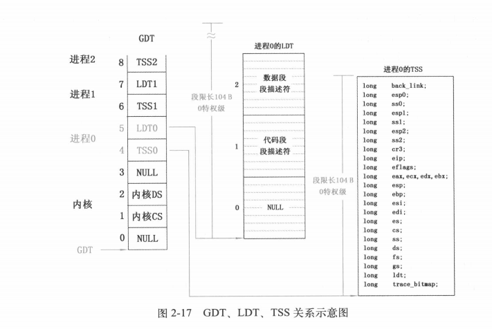

## 什么是段描述符
为了内存安全性，必须为内存段添加一些额外的安全属性，如特权级、段界限、段类型等。描述内存段属性的数据结构就叫段描述符。其结构定义如下所示：
一个段描述符是8字节大小，它描述了一个内存段的地址范围和各种属性。
## 局部描述符和全局描述符的关系

TSS段和LDT段都存储在GDT中，
## 全局描述符表
全局描述符表（Global Descriptor Table，GDT）是保护模式所必须的数据结构，引入GDT主要是出于系统安全性、内存寻址方式的兼容等方面的考虑。

一个段描述符只用来定义一个内存段，这些描述符都存放在全局描述符表中。GDT相当于存放段描述符的数组，而索引则是选择子。
## 局部描述符表
局部描述符表（Local Descriptor Table，LDT）是CPU厂商为在硬件一级原生支持多任务而创建的表，按照设想，一个任务对应一个LDT。但现代操作系统中很少使用LDT。

LDT的设计厂商建议每个任务的私有内存段都应该放到自己的段描述符表中，即每个任务都要有自己的LDT，随着任务的切换，也要切换到相应任务的LDT。LDT需要先在GDT中注册一个描述符，与GDT不同的是，LDT的第0个段描述符是可用的，因为选择子中的TI位为1才表示在LDT中索引段描述符，TI为1必然是经过显式初始化的结果。
