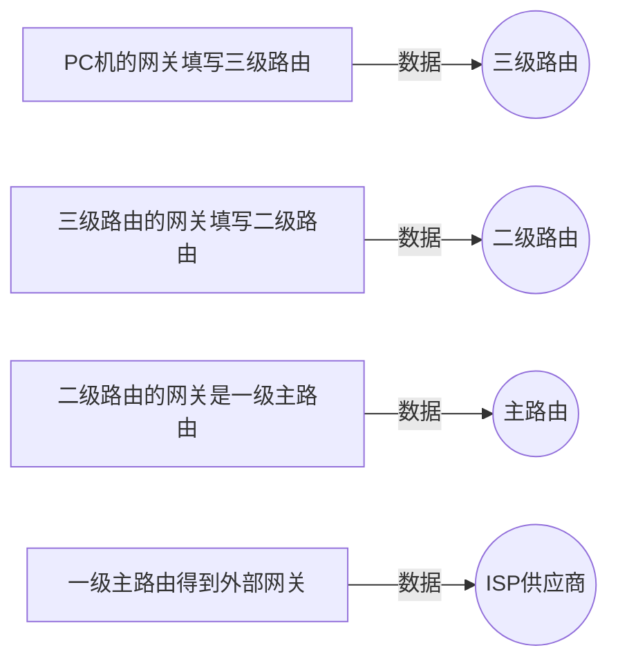

## 网卡
在计算机中，IP地址是分配给网卡的，每个网卡有一个唯一的IP地址（一个IP地址对应多个网卡），如果一个计算机有多个网卡，则该台计算机则拥有多个不同的IP地址，在同一个网络内部，IP地址不能相同。

Linux中，以太网接口被命名：eth0，eth1等
用ifup，ifdown来启动和禁用接口！

网卡需要配置IP地址
配置网卡：`ifconfig eth0 192.168.1.156`
==一块网卡绑定一个IP，但这样会给上网带来不便。因为有些人会用同一台笔记本电脑在不同的地方上网，在学校的时候，白天在教研室上网，晚上回宿舍上网，总是需要重新设置IP地址，默认网关，DNS，觉得很麻烦。如果一个网卡可以绑定多个IP，就不会有这样的问题了。==
## IP地址
==双层结构==：网络部分+主机部分 = 32位
网路部分：标识所属区域。
主机部分：标识该区域中哪个主机。
- 我们通过子网掩码来确定网络部分的位数。（相对应的子网掩码为1的部分为网络部分。）
- 通过比较网络部分是否相同来判断是否处于同一网络。
##  MAC地址
同一个网络之内，主机之间的通信。

192.168.1.1向192.168.1.2发送信息！
发送地址解析协议：ARP，将IP地址转换为MAC地址！
主机之间通信首先先发送ARP，来查询MAC地址。
## 网关/路由器
==设备都需要网关==
三级网关（风向标）：
1. 一级网关（填写主路由）：指向主路由
2. 二级路由（填写二级路由）：指向二级路由
3. 三级路由（填写三级路由）：指向三级路由
==主路由的网关：外部IP，公网网关（ISP提供）==
==以上的二级三级路由也需要网关，也需要填写IP地址。==

访问其他的网段，网关确认，不是子网的，发送给路由器。需要路由器转发（网络部分不同的）。

路由器一般有多个接口，连接到不同的网络中，并且通过路由表进行数据转发。
路由表：
目标网络|子网掩码|出接口
---|---|-
192.168.1.0|255.255.255.0|eth0
172.16.1.0|255.255.0.0|eth1
6.1.1.0|255.255.255.252|eth2
##  防火墙
定义：一个设备，有IP地址。
==一般有三级防火墙==
- 防火墙的布置
将二级的网关指向三级防火墙，3级防火墙的网关指向2级防火墙，2级防火墙的网关指向一级防火墙，一级防火墙的网关指向主路由！

防火墙有规则，有的数据能通过，有的数据不能走，什么端口能通，什么端口不能通！
==防火墙通过端口转发来隐藏真实的端口！==

## DHCP服务器
==路由器，无线路由一般自带DHCP功能。==
DHCP服务器：同一个网段，只能存在一个DHCP服务器。
- 设置网络IP范围。
- 设置网关。
- 设置DNS服务器的IP。

DHCP（Dynamips Host configuration Protocal）动态主机配置协议是一种基于UDP协议且仅限于在局域网内部使用的网络协议，主要用于大型的局域网环境或者存在较多移动办公设备的局域网环境中，其主要用途是用于自动管理局域网内主机的IP地址、子网掩码、网关地址及DNS地址等参数，可以有效地提升IP地址的利用率，提高配置效率，并降低管理与维护成本。

**在DHCP的工作原理中，DHCP服务器提供了三种IP分配方式：自动分配、手动分配和动态分配。**

-   **自动分配**是当DHCP客户端第一次成功的从DHCP服务器获取一个IP地址后，就永久的使用这个IP地址。
-   **手动分配**是由DHCP服务器管理员专门制定的IP地址。
-   **动态分配**是由客户端第一次从DHCP服务器获取到IP地址后，并非永久使用该地址，每次使用完后，DHCP客户端就需要释放这个IP，供其他客户端使用。
## 域名
www：网页服务器
mail：邮件服务
ftp：文件传输
## 基本网络参数
- 配置一个局域网通信的计算机
	1. IP地址
	2. 子网掩码
- 要配置一个跨网段通信的计算机：
	1. IP地址
	2. 子网掩码
	3. 网关
- 要配置一个可上网的计算机：
	1. IP地址
	2. 子网掩码
	3. 网关
	4. DNS
## df命令
Windows的打开我的电脑！
> Written with [StackEdit](https://stackedit.io/).
<!--stackedit_data:
eyJoaXN0b3J5IjpbMTQ3MDAzNzU4MF19
-->