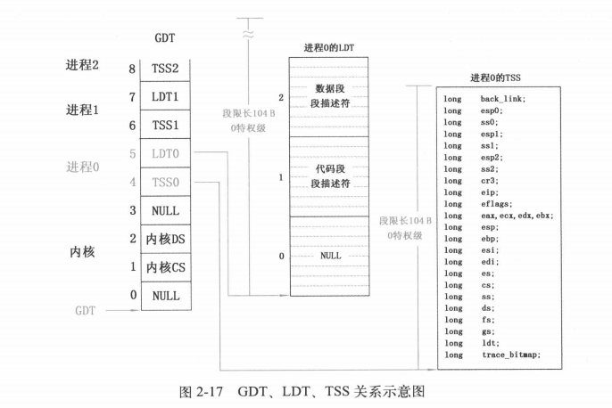

## 进程管理信息数据结构
- task_sruct
- task[64]
- GDT等

## task_struct
是每个进程所独有的结构。它标识了进程的各项属性，包括剩余时间片，进程执行状态，局部数据描述符表（LDT）和任务状态描述符表（TSS）等
## task[64]
是为管理多进程提供的数据结构，
task[64]结构中存储着系统所有进程的task_struct指针。
如果操作系统需要对多个进程加以比较选择，就可以通过遍历task[64]结构来实现。
## GDT
GDT中存储着一套针对所有进程的索引结构。通过索引项，操作系统可以间接的与每个进程中的LDT和TSS建立关系，关系如下图所示：
