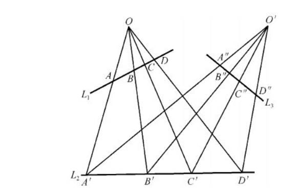
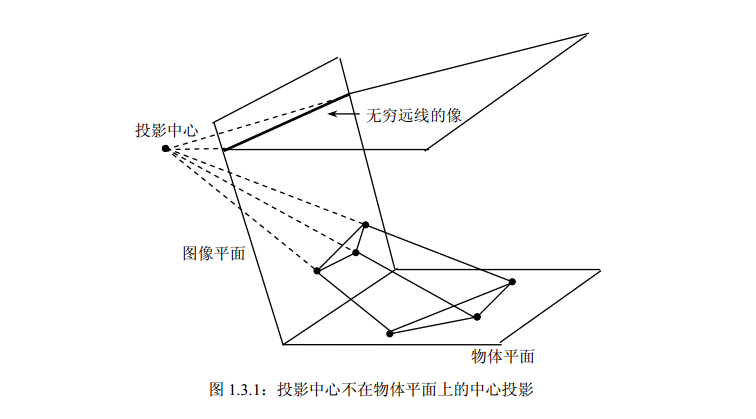
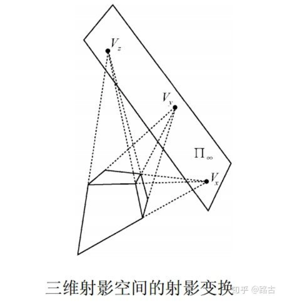

一个最为广义的线性变换
N维射影空间变换可以用代数式表示为$cy = T_px$，其中c为一比例因子，x,y分别为前后空间点的齐次坐标，$x = (x_1,x_2,....,x_{n+1})$,$y = (y_1,y_2,....,y_{n+1})$,射影变换由$T_p$矩阵决定，矩阵有$(n+1)^2$个参数，但是由于$T_p与kT_P$表示同一变换，故$T_P$的独立参数为$(n+1)^2$-1
- 射影变换具有简比和交比不变性。
- 任何射影变换都是将点变换到点，保持点的共线性质，因而将直线变为直线。
## 一维射影变换

如上图所示，点A总可以在L2上找到与其对应的点A'，实际上这种一一对应的变换，称之为一维中心射影变换

有限次中心射影变换的积定义的两条直线间的一一对应变换为一维射影变换。
## 二维射影变换(透视变换)

射影变换有时又称为单应，而矩阵H称为射影矩阵或称为单应矩阵。

投影中心不在物体平面上的中心投影是一个投影变换。中心投影将物体平面上的点投影到图像平面上得到像点。

物体平面点到像点之间的变换是一个射影变换。

物体平面上的无穷远点的像点是该无穷远点与投影中心的连线（平行于物体平面）与像平面的交点，一般地该交点是像平面上的有限点（即该点在图像平面中的齐次坐标的第三个分量不为零）。

## 空间射影几何
三维射影变换（四维空间的展示）

