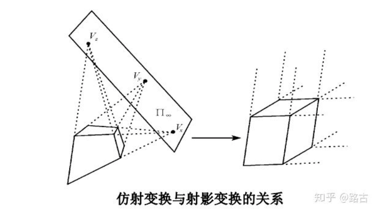

当射影变换中，投影点距离像平面无限远时，射影变换就变成了仿射变换。

有两种情况会用到仿射变换。
- 是有一幅图像，对它进行线形变换
- 通过计算一个点集合线形变换之后的点集合
## 二维仿射变换
仿射变换：**线形变换**
==仿射变换是射影变换的特例，是一类重要的线性几何变换，在射影变换中，当射影中心平面变为无限远时（投影平面倾斜旋转），射影变换就变成了仿射变换。==
- 射影几何可以证明，如果射影变换使得无穷远点仍变换为无穷远点，则变换为仿射变换
- 在一维射影模型中，x为无穷远点则x2 = 0，所以y2= 0；由此推导出$m_{21}= 0$
- 一般地，n维射影变换，仿射变换的条件变为$m_{n+1,m} = 0,(1<=m<=n)$,即M矩阵的最后一行的前n个元素为零（==注意是齐次坐标==）。

#### 原理
==仿射变换就是先对正交的坐标系进行线性变换，使得两个坐标系旋转一定的角度，然后在对变换之后的坐标系进行平移。==
- 仿射变换有6个未知数，所以要求解需要找到三组映射点，三点确定一个平面。
- 仿射变换是整体的拉伸和平移，是可以由3个点固定的变换。

$$\begin{bmatrix}x\\ y
\end{bmatrix} = \begin{bmatrix}
a11 &a12  &b1 \\
a21 &a22  &b2
\end{bmatrix}\begin{bmatrix}u\\ v\\ 1\end{bmatrix}$$
- 为了书写的美观，可以在最后一行加上【0 ，0 ，1】，将其转化为3*3的大小

#### 各个元素的意义
上述矩阵中
- a11和a22分别是x，y轴的缩放变换
- a12是水平方向的拉伸（错切），a21是垂直方向的拉伸（错切）。
- b1和b2分别是x，y方向的平移
#### OpenCV实现
- 稠密仿射变换
对于第一种很明显的就是输入输出格式是图像。
cv2.warpAffine()函数
    - 输入：图像
    - 输出：图像
- 稀疏仿射变换
解决稀疏映射，点序列的仿射变换。
cv2.transform(src, m[, dst]) ---》dst
     - 输入：点序列
     - 输出：same size and depth as src。
#### 仿射矩阵的计算
cv2.getAffineTransform()
     - 输入：src 图像
     - 输入：dst 图像
     - 输出：2*3矩阵
## 三维仿射变换

- 在三维射影空间中，射影变换矩阵Tp可以表示为4*4 可逆矩阵，它有16个参数，由于齐次性，有15个自由度。
- 在三维仿射空间中，仿射变换矩阵可以表示为4*4可逆矩阵，但是最后一行的前三个元素为0，因此仿射变换矩阵有12个自由度。

> Written with [StackEdit](https://stackedit.io/).
<!--stackedit_data:
eyJoaXN0b3J5IjpbNjUyNDQ1MDA2LDE4NTU5MzQ4NDhdfQ==
-->
