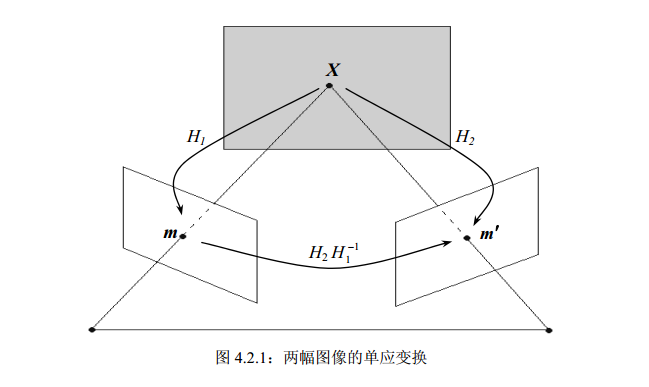

本节介绍主要是两个视点图像间的几何关系，即所谓的两幅图像之间的极几何
## 基本矩阵
极几何是两幅图像的点、线关联关系(对应点在对应极线上)，这种关联关系可用所谓的基本矩阵进行代数描述。基本矩阵有 7 个自由度，从 8 对图像点对应可以线性唯一确定。在射影(等价)意义下，基本矩阵确定了两幅图像所对应的摄像机矩阵。
- 极平面
- 极线
- 极点

#### 不足
极几何约束与埸景结构无关，也就是说极几何约束对于任何三维埸景结构的两幅
图像都成立，因此它不能给出两幅图像点间的一一对应关系，只能给出点对应的必要条件，即图像点在另一幅图像上的对应点位于对应的极线上，不可能给出对应点的确切位置。
## 单应矩阵
如果已知埸景结构的某些信息，无疑两幅图像对应点的约束会得到加强。

空间平面在两个摄像机下的投影几何。空间平面在两个摄像机下图像点具有一一对应关系，这个一一对应关系是齐次线性的，可由一个 3 阶矩阵即所谓的单应矩阵来描述。
- 不通过两摄像机任一光心的空间平面

- 两个场景结构只有纯旋转

## 基本矩阵的估算
