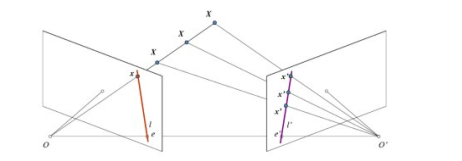
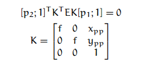
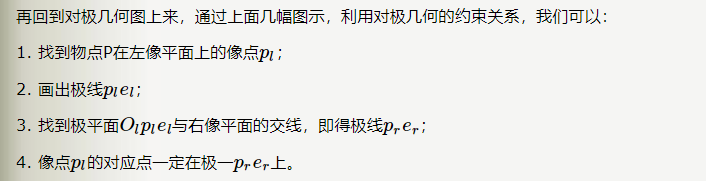

本节介绍主要是两个视点图像间的几何关系，即所谓的两幅图像之间的极几何
## 背景介绍
我们使用针孔相机时，我们会丢失大量的重要信息，比如说图像的深度，或者说图像上的点和摄像机的距离，因为这是一个3D到2D的转换。

因此一个重要的问题就产生了，使用这样的摄像机我们能否计算出深度信息呢？答案就是使用多个相机。

如果只用一台摄像机我们不可能知道3D空间中X点到图像平面的距离，因为OX连线上每个点投影到图像平面上的点都是相同的。
但是如果我们也考虑上右侧的图像的话，OX上的点将投影到右侧图像上的不同位置。
所以根据两幅图，我们就可以使用三角测量计算出3D空间中的点到摄像机的距离。
## 本征矩阵
标识为E，包含了物理空间中两个摄像机相关的旋转和平移信息（操作的是相机坐标系的物理坐标）。

矩阵E和单应性矩阵几乎完全相同，K是摄像机的内参数矩阵。尽管他们都是由相同的信息构建的，但是二者还是有些差异，不能混为一谈，求解的点数N大于等于5。
- H定义的本质是我们所考虑的为摄像机的观察平面，从而把该平面上的点与摄像机平面上的匹配点关联起来
- 而矩阵E没有这个假设，他仅仅是将一幅图像上的点和另外一幅图像上的点联系起来
## 基础矩阵
两个相机的坐标无任何约束关系，相机的内部参数可能不同，甚至是未知的。要刻画这种情况下的两幅图像之间的对应关系，需要引入两个重要的概念：对极矩阵和基本矩阵。

基础矩阵包含两台摄像机相关的所有几何信息，但不包括摄像机本身的任何信息，在实际应用中，我们通常只对像素坐标感兴趣。为了探索图像上的像素和它在另一幅图像上的对应极线的关系，就必须引入摄像机的内参数信息。

F包含了E与摄像机的内参数矩阵。求解的点数大于等于7。
==基础矩阵F将一幅图像中的点映射到另一幅图像中线上（操作的是像素坐标）。在本征矩阵的基础上应用摄像机矩阵将空间点转化为像素点。==

==基础矩阵不能给出两幅图像的像点的一一对应的关系，只能给出像点到另一幅图像的对极线的映射关系,三维点如果不是在同一个平面上，可以使用基础矩阵F来计算图像上像点在另一幅图像上对应的对极线，而不能使用单应矩阵H得到对应点的确切位置。==

极几何是两幅图像的点、线关联关系(对应点在对应极线上)，这种关联关系可用所谓的基本矩阵进行代数描述。基本矩阵有 7 个自由度，从 8 对图像点对应可以线性唯一确定。在射影(等价)意义下，基本矩阵确定了两幅图像所对应的摄像机矩阵。
- 极平面
平面XOO'称为对极平面
- 极线
直线OX上不同点投影到右侧图像上形成的线l'被称为与X点对应的极线。
- 极点
右侧摄像机的中心O'投影到左侧图像平面的e点，这个点就被称为极点，极点就是摄像机中心连线与图像平面的交点，因此e'是左侧摄像机的极点。【有些情况，我们可能不会在图像中找到极点，它们可能落在图像之外（这说明这两个摄像机不能拍摄到彼此）】
- cv2.findFundamentalMat(points1, points2[, method[, param1[, param2[, mask]]]]) ! retval,
mask
#### 不足
极几何约束与埸景结构无关，也就是说极几何约束对于任何三维埸景结构的两幅
图像都成立，因此它不能给出两幅图像点间的一一对应关系，只能给出点对应的必要条件，即图像点在另一幅图像上的对应点位于对应的极线上，不可能给出对应点的确切位置。
## 单应矩阵
两个图像平面像素点之间的变换关系

如果已知埸景结构的某些信息，无疑两幅图像对应点的约束会得到加强。

空间平面在两个摄像机下的投影几何。空间平面在两个摄像机下图像点具有一一对应关系，这个一一对应关系是齐次线性的，可由一个 3 阶矩阵即所谓的单应矩阵来描述。
- 不通过两摄像机任一光心的空间平面

- 两个场景结构只有纯旋转

## 基本矩阵的估算
