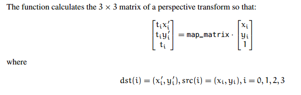

==透视变换也就是通俗的射影变换，也就是二维的射影变换==
## 透视变换（二维射影变换）
仿射变换是将矩形映射为任意平行四边形；而更一般的情况是，透视变换将矩形映射为任意四边形，透视变换包含仿射变换。
==虽然透视变换可以表示为一个矩阵，但是它并不是线形变换，因为变换要求除以最后一维Z，在处理过程中丢掉最后一维信息。==

透视变换分为密集透视变换和稀疏透视变换
#### 密集透视变换（or Homography）
将一幅图像的点集转换为另一幅图的点集，将两维映射到另外两维。
- 密集透视变换矩阵是3\*3，仿射变换矩阵是2\*3
- 透视变换需要四个点，仿射变换需要三个点
- 透视变换方程有8个未知数，所以求解就需要找到四组映射点，四个点刚好确定一个三维空间一个平面位置，以下是三维坐标系之间的变换。
- $$\begin{bmatrix}x\\y\\w
\end{bmatrix} = \begin{bmatrix}
a11 &a12  &a13 \\
a21 &a22  &a23\\
a31&a32&a33
\end{bmatrix}\begin{bmatrix}x'\\ y'\\ w'\end{bmatrix}$$

#### 稀疏透视变换
透视变换实际上是一个嵌入在三维空间的二维平面上的实际点映射回一个不同的二维子空间，把这个情况想象为摄像机的行为。摄像机将三维点映射到二维空间。
- 这里使用变换矩阵既可以是3\*3矩阵，也可以是4*4的，
- 如果为3*3的，便是投影从2维变为2维
- 如果是4*4的，投影从4维变成3维
## OpenCV应用
需要3*3变换矩阵，变换前后还是直线，需要输入图像上的4个点，以及他们在输出图像上对应的位置。
- 密集透视变换
整个图像的透视变换
cv2.warpPerspective()
    - 输入：图像
    - 输出：透视变换后的图像，射影变换后的图像。
- 稀疏透视变换
点序列的透视变换
cv2.perspectiveTransform()
    - 输入：点序列2D/3D序列
    - 输出：same size and type as src。
## 计算透视矩阵
两个之间的关系
- getPerspectiveTransform只能接受四个点，而且没有估计的方法，要求坐标点准确
- findHomography可以接受很多点，可以使用RANSAC算法来估计
- 两者在都是四点的情况下的矩阵结果是一样的
#### getPerspectiveTransform
必须输入图像上的4个点，以及他们在输出图像上对应的位置

- cv2.getPerspectiveTransform()：返回一个3*3的矩阵。
    - 输入src：Coordinats of source image。
    - 输入dst：coordinate of destination image。
#### findHomography
可以输入很多点，最后利用估计的方法来做
- cv2.findHomography(srcPoints, dstPoints[, method[, ransacReprojThreshold[, mask]]]) ! retval, mask
    - srcPoints 二维点
    - dstPoints 二维点
    - 返回一个3*3矩阵

> Written with [StackEdit](https://stackedit.io/).
<!--stackedit_data:
eyJoaXN0b3J5IjpbLTkxODE1OTQ4OCw5MDk5ODkxMzMsMTM3Mj
cyMDMwOSwzMzIzMTk4MTcsMTc0NjA0NDkyNCwtOTA4MzE2Nzcy
LDE5NDI5NDQzMTYsMTI5ODgyMTcyMywyODIwMjAzNjQsNzMwOT
k4MTE2XX0=
-->
