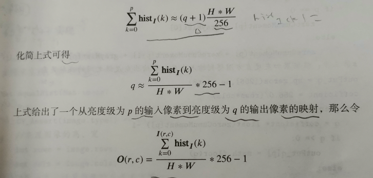
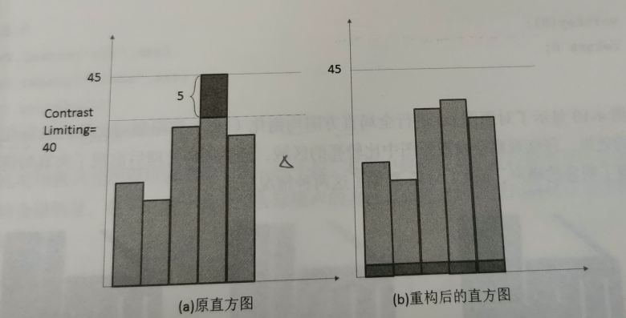

尽管我们通过各种方法来采集高质量的图像，但是有的图像还是不够好，需要通过图像增强技术提高质量。
在图像处理中，对比度增强只是图像增强技术的一种，它主要解决由于图像灰度级范围较小造成的对比度较低的问题，目的就是将输出图像的灰度级放大到指定程度，使得图像细节看起来更加清晰。
常用方法
- 线性变换
- 分段线性变换
- 直方图正规化
- 伽马变换
- 直方图均衡化
- 局部自适应直方图均衡化

## 线形变换
乘以常数，截断取值。
## 分段线形变换
对灰度值分段，然后对段内的灰度值进行线形变换
## 直方图正规化
就是将原图像的灰度值范围(Imin,Imax)，映射到另一个灰度值范围中去(Omin,Omax)。

$O(r,c) = \frac{O_{max}-O_{min}}{I_{max}-I_{min}}(I(r,c)-I_{min})+O_{min}$
可以使用normalize函数
- 1-范数---计算矩阵中值的绝对值的和
- 2-范数---计算矩阵中值的平方和的开方
- 无穷-范数---计算矩阵中值的绝对值的最大值||src|| = max|src(r,c)|
- minmax-范数---首先计算src的最小值min，src的最大值max，dst的像素值按照以下规则计算：dst= alpha*\frac{src(r,c)-min}{max-min}+beta
## 伽马变换
基于伽马变换的增强：类似于Log算子，对于小范围映射到大范围更显著。

## 全局直方图均衡化
假设输入图像为I，高为H，宽为W，hist1为I的灰度直方图，hist1(k)代表灰度值等于k的像素点的个数，其中k属于[0,255]。全局直方图均衡化操作是对图像I进行改变，使得输出的图像O的灰度直方图是“平”的，即每一个灰度级的像素点个数是“相等的”（约等），对于任意的灰度级p，总能找到q使得：$$\sum_{k=0}^{p}hist1(k) = \sum_{k=0}^{q}hist0(k)$$
又因为hist0(k)=H*W/256,代入上式中，可得：$$\sum_{k=0}^{p}hist1(k) = (q+1)H*W/256$$
化简之后可得：$$q = \frac{\sum_{k=0}^{p}hist1(k)}{H*W}* 256-1$$
上式给出的就是从亮度为p的输入像素到亮度级为q的输出像素的映射。

 - 计算灰度直方图。
 - 计算灰度直方图的累加直方图。
 - 根据累加直方图和原理得到输入和输出灰度级之间的映射关系。
 - 根据映射关系循环得到输出图像的每一个像素的灰度级。
## 限制对比度的自适应直方图均衡化
自适应直方图均衡化首先将图像分为不重叠的区域块(tiles)，然后对每一块分别进行直方图均衡化。
显然，在没有噪声影响下，每一块的灰度直方图会被限制在一个小的灰度级范围内；但是如果有噪声，每一个分割的区域块执行直方图均衡化之后，噪声会被放大，为了避免这种情况，提出了“限制对比度”，如果直方图的bin(某一像素值的像素点数)超过了提前预设好的限制对比度，那么就会被裁剪，然后将裁剪的部分均匀分布到其他的bin。

