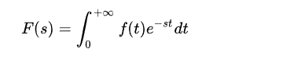
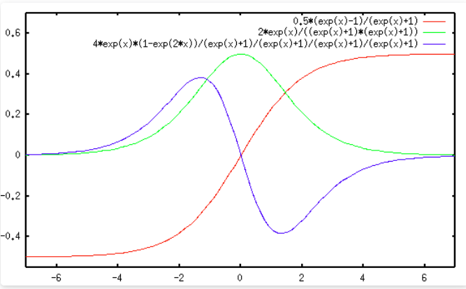
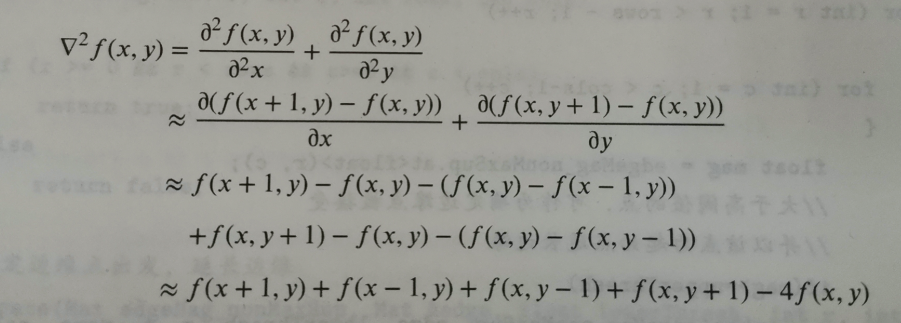

拉普拉斯变换可以说是现代工程学中使用最为广泛的数学工具，它通过数学变换将微积分方程转化为代数的方程，为求解连续空间连续时间的方程提供了可能。

傅里叶变换能帮我们解决很多问题，因为它给人们提供了一扇不同的窗户来观察世界，从这个窗户来看，很多事情往往变得简单多了。

但是，傅里叶变换有一个很大的局限性，就是信号必须满足狄利赫里条件才行，特别是那个绝对可积的条件。
聪明的数学家，就想到了一个绝佳的主意：把不满足绝对可积的函数乘以一个快速衰减的函数($e^{-\sigma x}$)，这样趋于正无穷也就衰减到零了,然后再进行傅里叶变换乘以$e^{-iwt}$，那么如果假设$s=\sigma +iw$
那么就得到了

总结：傅里叶变换是将函数分解到频率不同、幅值恒为1的单位圆上；拉普拉斯变换是将函数分解到频率幅值都在变化的圆上。因为拉普拉斯变换的基有两个变量，因此更灵活，适用范围更广。
## 背景
对于阶跃边缘，梯度算子检测的范围较广，如下图中绿色线波峰很宽域内值都近似，而laplace算子(蓝色线)计算的是过零点，显然精确很多，下图中红色线是阶跃信号。

## Laplacian算子
二维函数f(x,y)的Laplacian变换，由以下计算公式定义：

将其推广到离散的二维数组(矩阵)，即矩阵的拉普拉斯变换是矩阵与拉普拉斯核的卷积。
kernel = $\begin{bmatrix}0&1  &0 \\ 1&  -4& 1\\ 0&1 &0 \end{bmatrix}$
或者
kernel = $\begin{bmatrix}0&-1  &0 \\ -1& 4&-1\\ 0&-1 &0 \end{bmatrix}$

Laplacian边缘检测算子不像Sobel和Prewitt算子那样对图像进行了平滑处理，所以他会对噪声产生较大的响应，误将噪声作为边缘，并且得不到有方向的边缘，单独得到x方向，垂直方向或者其他方向上的边缘。
==优点是只有一个卷积核，计算成本比其他算子要低。==
