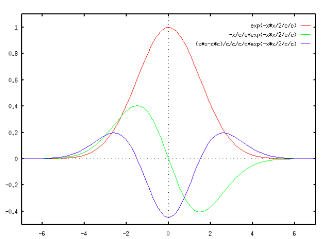

- 高斯拉普拉斯(LoG)边缘检测
- 高斯差分(DoG)
- Marr-Hildreth边缘检测
## 高斯函数性质
一维情形下高斯函数及其一阶导数，和LoG的曲线图
## 高斯拉普拉斯（LoG）边缘检测
拉普拉斯边缘检测算子没有对图像做平滑处理，会对噪声产生明显的响应，所以在用拉普拉斯核进行边缘检测时，首先对图像进行高斯平滑处理，然后再与拉普拉斯核进行卷积运算。这里进行了两次卷积运算，有没有可能用一次卷积运算就可以实现类似的效果呢？
答案是利用二维高斯核函数：
$gauss(x,y,\sigma) = \frac {1}{2\pi \sigma^2}exp(-\frac{x^2+y^2}{2\sigma^2})$
的拉普拉斯变换$$LoG(x,y) = \triangledown^2(gauss(x,y,\sigma))$$

拉普拉斯高斯卷积结果的响应函数，输入一个阶跃信号为左图，结果为右图。在边缘的一边为正值，另一边为负值，中间的边缘点为0。
下图展示的是LoG算子在极值点(Blob)处的响应。

高斯拉普拉斯边缘检测的具体步骤如下：
- 构建窗口大小为H*W，标准差为$\sigma$的LoG卷积核。
- 图像矩阵与卷积核卷积，结果记为I_Cow_LoG
- 以零为阈值，对边缘二值化显示$edge(r,c)=\left\{\begin{matrix}
255,   I_Cow_LoG(r,c)>0\\
0,    I_Cow_LoG(r,c)<=0
\end{matrix}\right。$这样显示的边缘以白色显示。

==这样高斯拉普拉斯边缘检测的效果与先进行高斯平滑，然后进行拉普拉斯边缘检测效果是类似的==

如果是检测边缘，则对过零点进行阈值化(过零点两边的最大值和最小值之间的差值要大于某个阈值)；如果是检测极值点，则极值点的LoG或DoG响应值应该大于某个阈值。
## 高斯差分（DoG）边缘检测
高斯滤波器可以提取图像的低频成分，我们知道高斯滤波器过滤的频率成分取决于参数$\sigma$的值，这个参数控制了滤波器的宽度，现在用两个不同带宽的高斯滤波器对同一幅图像做滤波，然后将两个结果相减，就能够得到较高评率构成的图像，如果选择合适的$\sigma$值，DOG其实很好的可以模拟LoG滤波器。

即DoG算子和LoG算子具有类似的波形，仅仅是幅度不同，不影响极值点的检测，而DoG算子的计算复杂度显然低于LoG，因此一般使用DoG代替LoG算子。
- 二维高斯函数对$\sigma$的一阶偏导数学表达式上等于高斯拉普拉斯乘以$\sigma$
- 又根据一阶导数的定义，一阶偏导可以近似约等于$$\frac{gauss(x,y,k*\sigma)-gauss(x,y,\sigma)}{k*\sigma-\sigma}$$
- 根据上述两个公式，显然可以得到高斯拉普拉斯的近似值$$\frac{gauss(x,y,k*\sigma)-gauss(x,y,\sigma)}{\sigma^2(k-1)}$$，该近似值通常称为高斯差分(DoG)，当k = 0.95时，高斯拉普拉斯核高斯差分的值时近似相等的。

高斯差分边缘检测的步骤如下：
- 构建窗口大小为H*W的高斯差分卷积核。
- 图像矩阵与DoG核卷积，结果为I_Cow_DoG
- 与高斯拉普拉斯边缘检测效果对比

高斯差分核是两个非归一化的高斯核的差，已知高斯核又是可分离的，所以用在程序上，为了减少计算量，可以不用创建高斯差分核，而是直接根据卷积的加法分配率和结合律的性质，图像矩阵分别与两个高斯核卷积，然后做差。
## Marr-Hildreth边缘检测
高斯差分核高斯拉普拉斯是Marr-Hildreth边缘检测的基底。对于高斯差分和高斯拉普拉斯边缘检测，最后一步只是简单地进行阈值化处理，显然所得到的边缘和粗略，不够精准，所以Marr-Hildreth边缘检测可以简单地理解为对高斯差分和高斯拉普拉斯检测到的边缘的细化，就像Canny对Sobel，Prewitt检测到的边缘的细化一样。
- 第一步：构建窗口大小为H*W的高斯拉普拉斯或者高斯差分卷积核。
- 第二步：图像矩阵与LoG核或者DoG核卷积。
- 第三步：通过第二步得到的卷积结果寻找过零点位置，过零点位置即为边缘位置。

原理是二阶导数的零点是一阶导数的最大值，即是边缘变化最快的位置
#### python实现
以3*3邻域为例：
- 判断过零点的方法一：判断邻域内是上下，左右，左上/右下，右上/左下方向是否出现异号，对于这四种情况，只要一种情况出现异号，该位置就过零点，即为边缘点。
- 判断过零点的方法二：与第一种方式类似，只是首先计算左上，右上，左下，右下的4个2*2邻域内的均值。对于这四个邻域内的均值，只要任意两个均值是异号的，该位置就是过零点，即为边缘点。
## 参考
[http://homepages.inf.ed.ac.uk/rbf/HIPR2/log.htm]()
[https://senitco.github.io/2017/06/20/image-feature-LoG-DoG/]()
[https://www.cnblogs.com/YiXiaoZhou/p/5892083.html]()
