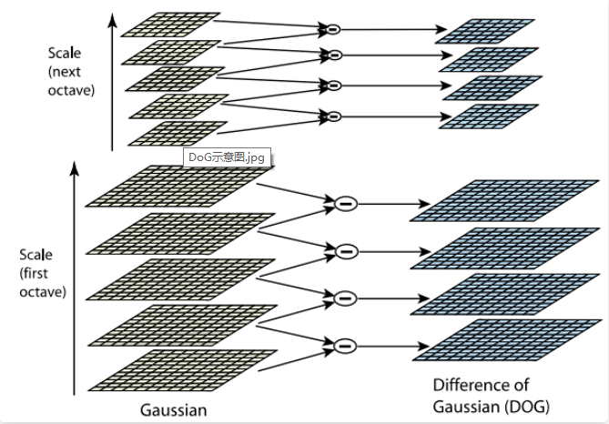

哥伦比亚大学的lowe教授在现有基于不变量的特征检测方法基础上，提出了一种基于尺度空间的，对图像缩放，旋转，基于仿射变换保持不变形的图像局部特征描述算子——sift（尺度不变特征变换）

Sift提取图像的局部特征，在尺度空间上寻找极值点，并提取出位置，尺度，方向信息。

==实质是在不同的尺度空间上查找关键点，计算关键点的大小，方向，尺度信息，利用这些信息组成关键点对特征点进行描述的问题。==

## 注意
SIFT并不检测关键点（关键点可以由Difference of Gaussians检测），但是SIFT会通过一个特征向量来描述关键点周围区域的情况。
- 关键点的绘制
有如下属性：pt（x，y坐标），size（特征的直径），angle（特征的方向），response（关键点的强度），octave（特征所在金字塔的层级），class_id（关键点的ID）。
## DoG
Difference of Gaussians
## 匹配方法
先生成一个实例对象，即==xfeatures2d==对象，然后调用SIFT_creat()方法来生成一个sift的检测器对象。

暴力匹配器，距离度量cv2.NORM_L2

第二个参数是布尔变量，crossCheck默认是false，如果它是true，匹配器返回那些和(i, j)匹配的，这样集合A里的第i个描述子和集合B里的第j个描述子最匹配。两个集合里的两个特征应该互相匹配，它提供了连续的结果。

当它创建以后，两个重要的方法是BFMatcher.match()和BFMatcher.knnMatch()。第一个返回最匹配的，第二个方法返回k个最匹配的，k由用户指定。当我们需要多个的时候很有用。

## 特点
1. 对旋转，尺度缩放，亮度变化保持不变形，对视角变化，噪声也存在一定程度的稳定性；
2. 独特性，信息量丰富，适用于在海量特征数据中快速，准确的匹配；
3. 多量性，即使少数几个物体也可以产生大量的sift特征向量；
4. 可扩展性，可以很方便的与其他形式的特征向量进行联合；

## 流程

## 具体步骤
1. 生成高斯差分金字塔（DOG金字塔），尺度空间构建。
通过对原始图像进行尺度变换，获得图像多尺度下的尺度空间表示序列，对这些序列进行尺度空间主轮廓的提取，并以该主轮廓作为一种特征向量，实现边缘，角点检测不同分辨率上的关键点提取等。

这里DoG近似等于尺度归一化的高斯拉普拉斯算子,而尺度归一化的高斯拉普拉斯算子相较于其他角点检测算子，如梯度，Hessian或Harris焦点特征能够更稳定的图像特征
2. 空间极值点的精确定位
每一个像素点要和它所有的相邻点比较，看其是否比它的图像域和尺度空间域的相邻点大或者小。
二维图像空间，中心点与它3*3邻域的8个点做比较。在同一组内的尺度空间上，中心点和上下两层图像的26个点比较，如此可以确保检测到的关键点在尺度空间上和二维空间上都是局部极值点。
3. 稳定关键点的精确定位
DOG值对噪声和边缘比较敏感，所以在第二步的尺度空间中检测到的局部极点值还要经过进一步的筛选，去除不稳定和错误检测出的极值点。
4. 稳定关键点方向信息分配
稳定的极值点是在不同尺度空间下提取的，这保证了关键点的尺度不变性。为关键点分配方向信息所要解决的问题是==使得关键点对图像角度和旋转具有不变性==。
方向的分配是通过求每个极值点的梯度来实现的。
任意一点的梯度幅度：
$m(x,y)  = \sqrt{(L(x+1,y)-L(x-1,y))^2+(L(x,y+1)-L(x,y-1))^2}$
梯度方向为：
$\Theta (x,y) = tan^{-1}\left [\frac{L(x,y+1)-L(x,y-1)}{L(x+1,y)-L(x-1,y)}\right ]$
分配给关键点的方向并不直接是关键点的梯度方向，而是按照一种梯度直方图的方式给出的。
具体方法：
计算以关键点为中心的邻域内所有点的梯度方向，当然梯度方向一定是在0-360范围内，对这些梯度方向归一化到36个方向内，每个方向代表10度的范围。==然后累计落到每个方向的关键点的个数，以此生成梯度直方图。==

5. 关键点描述
描述其实就是一种以数学方式定义关键的过程。描述子不但包含关键点，也包括关键点周围对其有贡献的邻域点。

	描述的思路是：对关键点周围像素区域分块，计算块内梯度直方图，生成具有独特性的向量，这个向量是该区域图像信息的一种抽象表述。
	 如下图，对于2*2块，每块的所有像素点的梯度做高斯加权，每块最终取8个方向，即可以生成2*2*8维度向量，以这2*2*8维向量作为中心关键点的数学描述。
	 实验表明，对每个关键点，采用4*4*8共128维向量的描述子进行关键点表征，综合效果最佳：
6. 特征点匹配
特征点的匹配是通过计算两组特征点的128位向量的欧式距离实现的。欧式距离越小，则相似度越高，当欧氏距离小于设定的阈值时，可以判定为匹配成功。

## 附录参考
[https://www.cnblogs.com/YiXiaoZhou/p/5893835.html]()
> Written with [StackEdit](https://stackedit.io/).
<!--stackedit_data:
eyJoaXN0b3J5IjpbLTIxODczOTk5OV19
-->
