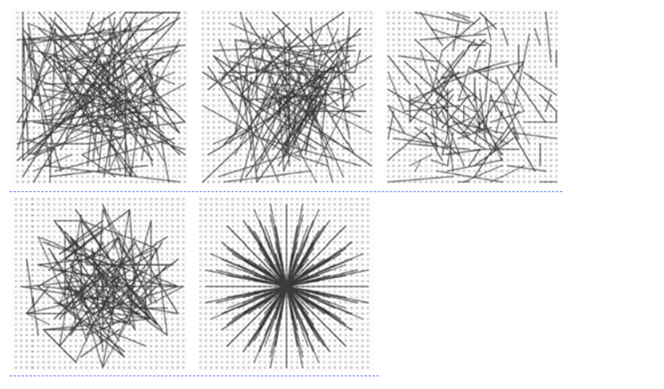

BRIEF(Binary Robust Independent Elementary)并不是特征检测算法，它只是一个描述符。

我们知道 SIFT 算法使用的是 128 维的描述符。由于它是使用的浮点数，所以要使用 512 个字节。同样 SURF 算法最少使用 256 个字节（64 为维描述符）创建一个包含上千个特征的向量需要消耗大量的内存，在嵌入式等资源有限的设备上这样是不合适的。匹配时还会消耗更多的内存和时间。

但是在实际的匹配过程中如此多的维度是没有必要的。我们可以使用 PCA，LDA 等方法来进行降维。甚至可以使用 LSH（局部敏感哈希）将 SIFT 浮点数的描述符转换成二进制字符串。对这些字符串再使用汉明距离进行匹配。汉明距离的计算只需要进行 XOR 位运算以及位计数，这种计算很适合在现代的CPU 上进行。但我们还是要先找到描述符才能使用哈希，这不能解决最初的内
存消耗问题
## 概念原理
BRIEF 应运而生。它不去计算描述符而是直接找到一个二进制字符串。这种算法使用的是已经平滑后的图像，它会按照一种特定的方式选取一组像素点对 nd (x， y)，然后在这些像素点对之间进行灰度值对比。例如，第一个点对的灰度值分别为 p 和 q。如果 p 小于 q，结果就是 1，否则就是 0。就这样对 nd个点对进行对比得到一个 nd 维的二进制字符串。

nd 可以是 128， 256， 512。 OpenCV 对这些都提供了支持，但在默认情况下是 256（OpenCV 是使用字节表示它们的，所以这些值分别对应与 16，32， 64）。当我们获得这些二进制字符串之后就可以使用汉明距离对它们进行匹配了。


值得注意的是，对于BRIEF，它仅仅是一种特征描述符，它不提供提取特征点的方法。所以，如果你必须使一种特征点定位的方法，如FAST、SIFT、SURF等。

## 关于点对的选择
设我们在特征点的邻域块大小为S×S内选择nd个点对(p,q)，Calonder的实验中测试了5种采样方法：
1）在图像块内平均采样；
2）p和q都符合(0,125S2)的高斯分布；
3）p符合(0,125S2)的高斯分布，而q符合(0,1100S2)的高斯分布；
4）在空间量化极坐标下的离散位置随机采样
5）把p固定为(0,0)，q在周围平均采样

## 示例用法
计算在图像(第一个变体)或图像集(第二个变体)中检测到的一组关键点的描述符
`cv2.DescriptorExtractor_create.compute(image, keypoints[, descriptors])--->keypoints, descriptors`

```py
import numpy as np
import cv2
from matplotlib  import pyplot as plt

img = cv2.imread('simple.jpg',0)

star = cv2.FeatureDetector_create("STAR")
brief = cv2.DescriptorExtractor_create("BRIEF")

kp = star.detect(img,None)
kp,des = brief.compute(img,kp)

print(brief.getInt("byte"))
print(des.shape)
```


> Written with [StackEdit](https://stackedit.io/).
<!--stackedit_data:
eyJoaXN0b3J5IjpbLTQwMjM5MDE5MF19
-->
