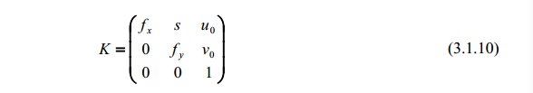

图像上每一点的亮度与物体某个表面点的反射光强度有关，而图像点在图像平面上的位置仅与摄像机与物体的相对方位(外参)和摄像机的内部结构有关，摄像机的内部结构是由摄像机的内部参数所决定的。

变换的对象是物体在摄像机坐标系下的==三维坐标(欧式)==和==图像平面坐标系的二维坐标==
## 基本模型

如上图所示。点 Oc 称为摄像机中心(或光心)， f 称为摄像机的焦距，以点 Oc 为端点且垂直于像平面的射线称为光轴或主轴，主轴与像平面的交点 p 称为摄像机的主点。

根据三角形相似原理，可以推知空间点Xc与它的像点m满足下述关系

上述可表述为下矩阵形式，其中$X_c = (x_c,y_c,z_c,1),m = (x,y,1)^T$分别为空间点和图像点的齐次坐标：

在实际应用中，由于事先不知道主点的确切位置（上述p的位置），通常都是以图像中心或者图像的左上角作为图像坐标系的原点来建立图像坐标系，在此坐标系下，由于主点可能不是图像坐标系的原点，因此摄像机矩阵不再可能具有上述形式，若主点在上述坐标系下p = （x0,y0,1）,则摄像机的投影关系变为：

摄像机矩阵的形式为P=K(I,0),其中

并称它为摄像机内参数矩阵。
## CCD摄像机
用于计算机处理的图像通常都是用 CCD 摄像机所获取的数字图像，或者是由模拟信号摄像机获取的图像再经过特别设备进行数字离散化的数字图像。一般地， CCD 摄像机内参数矩阵不具有(3.1.6)的形式。为了得到 CCD 摄像机的模型，必须刻划 CCD 摄像机的数字离散化过程。

假设CCD摄像机数字离散化后的像素是一个矩形，矩形的长与宽分别为dx，dy。设图像点(x,y,1)在离散化的坐标为(u,v,1)，则必有

如果离散化的图像坐标仍用m表示，则摄像机的投影关系可以写成：
$$m = K(I,0)X_c = PX_c$$
其中K的表达式如下：

矩阵K称为CCD摄像机的内参数矩阵，$f_x = f/d_x,f_y = f/d_y$称为CCD摄像机在u轴和v轴上的尺度因子，$u_0,v_0$称为CCD摄像机的主点。
由于制造工艺限制，一般情况下，CCD摄像机离散化后的像素不是一个矩形而是一个平行四边形，四边形一边平行于u轴，而另一边与u轴形成一个角度，如果平行四边形的两个边长$d_x,d_y$,则有：
，综合3.1.5式可得：

最后化简K：

是摄像机的内参数矩阵，其中$f_x = f/d_x,f_y = fsin\theta/d_y$称为CCD摄像机在u轴和v轴方向上的尺度因子， $(u_0,v_0)^T = ((x_0-y_0ctg\theta)/d_x , y_0sin\theta/d_y)^T$称为CCD摄像机的主点
## 摄像机矩阵的一般形式
上面所介绍的摄像机矩阵是在摄像机坐标系下的结果。由于摄像机的中心和主轴事先都是未知的，这个坐标系不能给出空间点的具体坐标值，另外摄像机可以安放在环境的任何位置，所以需要一个基准坐标系来描述空间点和摄像机的位置。这个基准坐标系称为世界坐标系。

世界坐标系与摄像机坐标系之间的关系可以用一个旋转矩阵和一个平移向量来描述，摄像机矩阵是一个秩为3的3*4矩阵，因为它的前三列所构成的子矩阵是一个可逆矩阵。另外由于摄像机矩阵P是齐次性的，所以它仅有11个独立元素（自由度）。
## 附录
摄像机矩阵元素的几何意义
- 摄像机中心
摄像机中心C=(C',1)是PC = 0的一个解，P是上述的摄像机矩阵，P仅有一维右零空间，因为它的秩为3，于是摄像机中心的齐次坐标构成P的右零空间。
- 坐标原点与坐标轴方向
记摄像机矩阵为 P = ( p1, p2 , p3, p4 ) ，其中 pj 为 P 的第j列向量。
世界坐标系的原点坐标为 X = (0, 0, 0, 1)T ，所以它的图像点坐标为

    - 即摄像机矩阵的第四列向量是世界坐标系原点图像的齐次坐标。
    - 摄像机矩阵的前三个列向量分别是世界坐标系三个坐标轴方向的图像点的齐次坐标。
- 主平面与轴平面
主平面：摄像机的坐标平面Oc-xcyc ，即与像平面平行的坐标平面，通常称为主平面。
轴平面：它是图像平面的 v 轴与摄像机中心所确定的平面，通常称它为轴平面。
- 主轴与主点
主轴：主轴与主平面是正交的，因此主轴必为主平面的法线，主轴过摄像机中心。
主点：主轴与像平面的交点。
