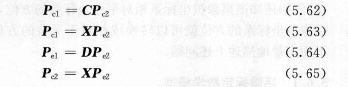

在计算机视觉应用于机器人技术时，经常将摄像机固定在机器人手臂的末端执行器上，其目的是当机器人的末端执行器在执行某任务时，由摄像机测定末端与工件的相对位置。

计算的对象是Ce和Cc，两个坐标系之间的相对位置由R,t来表示。==由于无法用人眼看到摄像机坐标系，R与t必须由定标的方法计算==

物理依据就是平台移动前后平台与摄像机的相对位置X不变。
基本思路是控制机器人手爪在不同的位置观察空间一个已知的标定参考物，从而推导出R，t与多次观察结果的关系

==原理==
将平台从A点移动到B点，$C_{c1},C_{c2},C_{e1},C_{e2}$分别为移动前后的相机坐标系和末端平台坐标系。
假设空间某点P在运动一次之后在上述四个坐标系中的坐标为：$P_{c1},P_{c2},P_{e1},P_{e2}$。
C为相机坐标系$C_{c1},C_{c2}$相对方位，由两次运动时机器人控制器给出，D为$C_{e1},C_{e2}$间的相对方位，由三次摄像机标定得到的外部参数给出。
则四个坐标点有如下关系：

最终得到
$$CX = XD$$
将上式由旋转矩阵与平移向量写出

展开上式得：
$$
R_cR = RR_d\\R_ct+t_c = Rt_d+t
$$
需要求解的是R与t即手眼之间的旋转矩阵和平移向量。
## 手眼标定过程
- 控制摄像机平台从A运动到B，运动前后均对摄像机做标定，求出其外参数，从而得到$R_{c1},t_{c1}$，由控制器读出平台运动参数$R_{d1},t_{d1}$
- 控制摄像机平台从B运动到C，运动前后均对摄像机做标定，求出其外参数，从而得到$R_{c2},t_{c2}$，由控制器读出平台运动参数$R_{d2},t_{d2}$
- 联立求解R，再求解t

当上述两次运动的旋转轴不互相平行时，解R是惟一的，当运动不是纯平移时，t也是惟一的。
## 算法分类
[参考](https://github.com/christianwengert/calib_toolbox_addon)
- Tsai-Lenz算法
- NAVY算法
- INRIA算法
- 对偶四元素手眼标定算法
## 求解算法
- 利用罗德里格斯变换将旋转矩阵变换为旋转向量。
- 向量归一化
- 修正罗德里格斯参数表示姿态变化
- 计算初始旋转向量
- 计算旋转向量
- 计算旋转矩阵
- 计算平移向量
