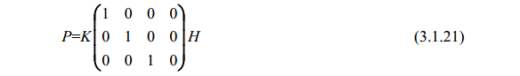
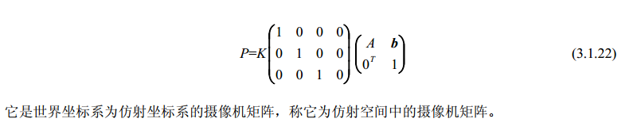
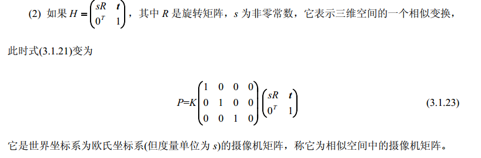
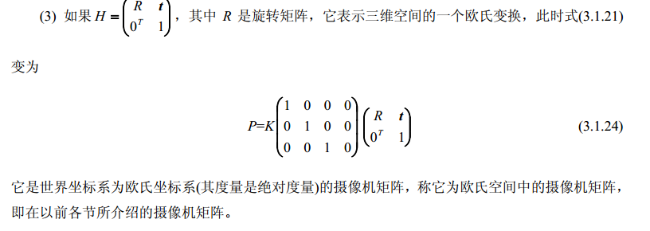
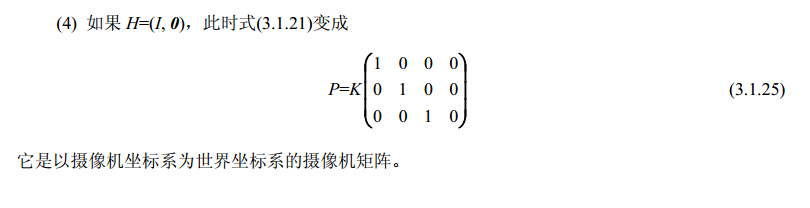

如果世界坐标系是一般射影坐标系，摄像机矩阵又具有什么样的形式呢？
==本节讨论的是摄像机矩阵的变换==

摄像机坐标系和射影坐标系之间的变换仍然可以用一个4*4的齐次矩阵H表示，并且由三维射影空间到图像平面的映射仍然可以用一个3*4矩阵P来描述。K为摄像机内参数矩阵，size为3*3大小。
事实上，对于最一般的情况，摄像机模型可以被看做是从三维映射空间到二维射影平面的映射，并且这个映射可以用下述矩阵合成：

如果$H = \begin{pmatrix}A &b \\ 0^T &1 \end{pmatrix}$，其中rank(A) = 3,它表示三维空间的一个仿射变换，上式就变为：

它是世界坐标系为仿射坐标系的摄像机矩阵，称它为仿射空间中的摄像机矩阵。

它是世界坐标系为欧氏坐标系(但度量单位为 s)的摄像机矩阵，称它为相似空间中的摄像机矩阵。

它是世界坐标系为欧氏坐标系(其度量是绝对度量)的摄像机矩阵，称它为欧氏空间中的摄像机矩阵，即在以前各节所介绍的摄像机矩阵。

它是以摄像机坐标系为世界坐标系的摄像机矩阵。
