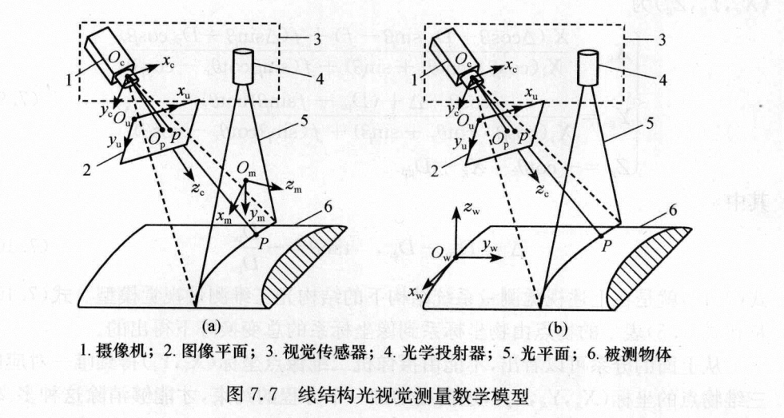
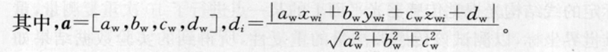

结构光三维视觉测量是基于光学三角法测量原理。光学投射器将一定模式的结构光投射于物体表面，在表面上形成由被测物体表面形状所调制的光条三维图像。该三维图像由处于另一位置的摄像机探测，从而获得光条二维畸变图像。
结构光模式
- 点结构光模式
- 线结构光模式
- 多线结构光模式
- 网格结构光模式

结构光三维视觉测量模型
- 解析几何模型
光学投射器，摄像机光轴之间的夹角等参数，根据空间解析方法求解被测特征的三维信息。该犯法需要准确调整结构光投射器或者摄像机的安装位置，能够有限度地满足特殊场合的运用要求。
- 透视投影测量模型
以透视投影理论为基础的结构光视觉测量模型是建立在以摄像机内部参数，视觉系统结构参数或者光平面方程为基础的新型检测模型，具有更广泛的适用性。
## 线面模型

由光学投射器投出的光平面与被测物体表面相交形成特征光条。特征光条上任意一特征点在空间的表达可以借助一条射线和光平面来表达。

特征光条上的特征点在摄像机平面上的图像坐标可以由图像处理获得。根据摄像机模型，特征点的图像坐标唯一对应空间的一条通过摄像机光学中心的射线，即可以得到射线在摄像机坐标系下的方程。

如果能获得光平面在摄像机坐标系下的方程，由射线方程和光平面方程可以唯一确定光条上特征点在摄像机坐标系下的三维坐标。

如图7.7(b)所示，$O_w-x_wy_wz_w$为世界坐标系，$O_c-x_cy_cz_c$为摄像机坐标系，$O_u-x_uy_u$为理想图像坐标系，其中$x_c$轴平行于$x_u$轴，$y_c$轴平行于$y_u$轴，$z_c$轴垂直于图像平面。$O_p$为主点（摄像机光轴与图像平面的交点）

设光平面任意点P在图像平面上的透视投影点为p，P的世界坐标系坐标为$(x_w,y_w,z_w)$,摄像机坐标为$(x_c,y_c,z_c)$，p的图像坐标为$(x_u,y_u)$。则结构光视觉测量的摄像机模型可以表示为：
$$\rho \begin{bmatrix}x_u\\ y_u\\ 1
\end{bmatrix}= A\begin{bmatrix}
 R_c^w&T_c^w
\end{bmatrix}\begin{bmatrix}x_w\\ y_w\\ z_w\\ 1
\end{bmatrix}=  \begin{bmatrix}
f_x &0  &u_0 \\
 0& f_y &v_0 \\
0 &0  &1
\end{bmatrix}\begin{bmatrix}
r1 &r2  &r3  &t_x \\
r4 &r5  &r6  &t_y \\
r7 &r8  &r9  &t_z
\end{bmatrix}\begin{bmatrix}x_w\\ y_w\\ z_w\\ 1
\end{bmatrix},\rho \neq 0$$
其中A为摄像机的内部参数矩阵，fx，fy为x，y方向上的有效焦距，(u0,v0)为主点坐标。$R_c^w,T_c^w$分别为3*3正交旋转矩阵，平移矢量，它们表示了$O_w-x_wy_wz_w$到$O_c-x_cy_cz_c$的变换。
光平面在$O_w-x_wy_wz_w$中的方程可以表示为
$a_wx_w+b_wy_w+c_wz_w+d_w = 0$
## 原理
在相机坐标系下，求出许多激光平面上的点的坐标(不共线)，然后通过描述的结构光平面方程取拟合这些点。
目标函数为点到平面的欧式距离的平方和，即
$$e(a) = \sum^{m}_{i=1}d_i^2$$

通过优化
