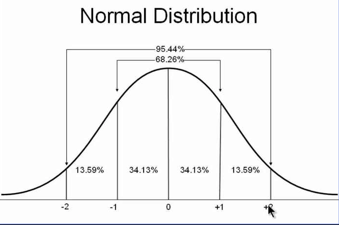

## numpy.random.rand(d0,d1,...,dn)
数据在[0,1)之间
## numpy.random.randn(d0,d1,...,dn)
按照标准正太分布的概率来返回响应的随机数，返回的数值的频率服从标准正态分布。

## numpy.random.randint(low, high=None, size=None, dtype='l')
参数分别指定数值的范围和size的大小。
## 生成[0,1)之间的浮点数
以下函数与rand的调用形式不同，这个参数是元组，上面的参数都是单个的维度的大小。
- numpy.random.random_sample(size=None)
- numpy.random.random(size=None)
- numpy.random.ranf(size=None)
- numpy.random.sample(size=None)
