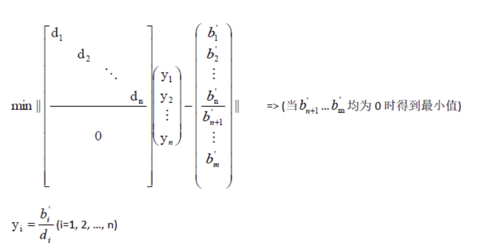

特征值分解是变换正交基，即对于一个线形变换，求出其要变换到目标空间的正交基。
而对于奇异值分解，是对于一个变维（与下面讨论的降维升维操作不同）的线性变换：$A = U\Sigma V^T$
- 先在原来的空间中（N维空间）旋转（变换正交基）,即左乘$V^T$。
- 然后进行放缩变换，放缩过程中，有可能某一维被压缩至0，也有可能生成新的一维，左乘$\Sigma$。
- 然后在M维空间中进行旋转变换,左乘$U$。

==放缩过程，有可能将某一维度，压缩至0，也可能生成新的一个维度，这就是变维操作==
## 概念
SVD是一种矩阵分解方法，相当于因式分解，它的目的纯粹就是将一个矩阵拆分成多个矩阵相乘的形式。
在实数范围内讨论，我们实质上是将一个复杂的变换 M:Rm→Rn 分解成了三个变换：旋转/镜像 U:Rm→Rm、缩放 Σ:Rm→Rn、旋转/镜像 V:Rn→Rn。

**奇异值分解应该就是把一个线性变换分解成三个线性变换，两个个线性变换代表旋转，另一个代表拉伸和变维；U和V都起到了对A旋转的作用，而Σ起到了对A缩放和降维升维的作用。特征值分解只有缩放的效果。**
## SVD的计算
SVD的求解可以使用特征值分解来求解，即对原线性变换矩阵进行协方差矩阵变换。【有一些SVD的实现算法可以不求先求出协方差矩阵$X^TX$，也能求出我们的右奇异矩阵V，经典的算法有：Golub-Kahan算法、分治法、Jacobi法】
对于：$A = U\Sigma V^T$
- 左边的正交（旋转）矩阵
相当于对$AA^T$做特征值分解得到的特征向量。
- 右边的正交（旋转）矩阵
相当于对$A^TA$做特征值分解得到的特征向量。
- 中间的$\Sigma$矩阵,由于Σ除了对角线上是奇异值其他位置都是0，那我们只需要求出每个奇异值σ就可以了
$A=UΣV^T⇒AV=UΣV^TV⇒AV=UΣ⇒Av_i=σ_iu_i⇒σ_i=Av_i/u_i$
也可以证明：奇异值等于那个维度比较小的正交矩阵的特征值矩阵开根号得到，然后其余位置补零即可。
$σ_i=\sqrt{λ_i}$
- 两个旋转矩阵的特征值矩阵
特征值矩阵的非零元素是相等的，对于维度大的那个特征值矩阵，多出来的对角元素为0。
## SVD性质
每一行都可以看做一个特征，每一行的数据的方差可以表示为样本之间在这个特征的差距。如果方差较大，证明这个特征就比较有意义，如果方差很小，说明这个特征就没有很大的意义，对于在一个特征里区分不同的样本。

对于奇异值,它跟我们特征分解中的特征值类似，在奇异值矩阵中也是按照从大到小排列，而且奇异值的减少特别的快，在很多情况下，前10%甚至1%的奇异值的和就占了全部的奇异值之和的99%以上的比例。也就是说，我们也可以用最大的k个的奇异值和对应的左右奇异向量来近似描述矩阵。也就是说：
$A_{m×n}=U_{m×m}\Sigma_{m×n}V^T_{n×n}≈U_{m×k}Σ_{k×k}V^T_{k×n}$

其中k要比n小很多，也就是一个大的矩阵A可以用三个小的矩阵U_{m×k},Σ_{k×k},V^T_{k×n}来表示。如下图所示，现在我们的矩阵A只需要灰色的部分的三个小矩阵就可以近似描述了。
## 应用
由于上述性质，SVD可以用于PCA降维，来做数据压缩和去噪。也可以用于推荐算法，将用户和喜好对应的矩阵做特征分解，进而得到隐含的用户需求来做推荐。同时也可以用于NLP中的算法，比如潜在语义索引（LSI）。下面我们就对SVD用于PCA降维做一个介绍。
#### 数据分析
我们搜集的数据中总是存在噪声：无论采用的设备多精密，方法有多好，总是会存在一些误差的。如果你们还记得上文提到的，大的奇异值对应了矩阵中的主要信息的话，运用SVD进行数据分析，提取其中的主要部分的话。
- 对数据进行降维
将奇异值比较小的设置为0，在空间中实现了降维。
我们找到了矩阵$XX^T$最大的d个特征值向量，张成的m*d矩阵U，做如下运算：
$A'=U^T_{d×m}A_{m×n}$得到一个新的数据样本A'，行数从m减少到了d，可见对行数进行了压缩，也就是说，左奇异压缩行，右奇异压缩列。
**总结来说：**
==如果对上述的两个正交矩阵，取其一部分，即特征值最大的那个几个向量组成一个新的线性变换，来对原数据样本做线性变换，即就是行压缩或者列压缩的操作==

- 去噪
将非常小的奇异值设置为0，一般都是由噪声引起的,可以实现降噪

SVD有个好处，有一些SVD的实现算法可以不求先求出协方差矩阵XTX，也能求出我们的右奇异矩阵V。也就是说，我们的PCA算法可以不用做特征分解，而是做SVD来完成。这个方法在样本量很大的时候很有效。
- 左奇异矩阵可以用于行数的压缩。
- 右奇异矩阵可以用于列数即特征维度的压缩。　　　　
#### 推荐算法
用于推荐算法，将用户和喜好对应的矩阵做特征分解，进而得到隐含的用户需求来做推荐。
#### 最小二乘解优化
[参考博文](https://www.cnblogs.com/liufuqiang/p/5663175.html)
- 非齐次方程
Ax = b
优化目标
min||Ax-b||
优化过程
对A奇异值分解，代入优化目标，
$min||UDV^Tx-b||==min||DV^Tx-U^Tb||==min||Dy-b'||$
- 齐次方程
目标：min||Ax= 0||
约束条件：||x|| = 1
目标函数：||Ax||

> Written with [StackEdit](https://stackedit.io/).
