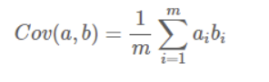
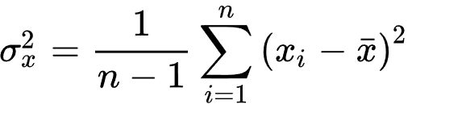
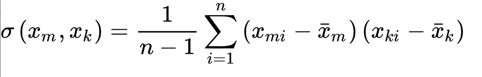

[本文参考](https://www.cnblogs.com/LittleHann/p/6558575.html#_lab2_1_3)
[本文参考](https://www.cnblogs.com/bjwu/p/9280492.html)
## 目的
主成分分析的目的
- 化繁为简，降低维数，抽象出核心资讯。
- 观察两个变数的相关性，可以画散点图。当维数较大时，画图不适用。
- 找出降维后的加权系数

## 原理
在原来的欧式标准M维坐标系下，通过观察样本点的分布，很难确定分割不同样本的准则【或者维度（基向量的数量）太高，计算量太大，对于有些基向量，对于区分样本意义不大】，思想就是将原来的数据样本，通过线形变换，变换（投影）到由另一组正交基构成的空间中，这些基向量正交的。
#### 协方差矩阵及优化目标
如何选择基才是最优的。或者说，如果我们有一组M维向量，现在要将其降到K维（K小于M），那么我们应该如何选择K个基才能最大程度保留原有的信息？

我们先分析二维的情况，在二维平面中选择一个方向，将所有数据都投影到这个方向所在直线上，用投影值表示原始记录。这是一个实际的二维降到一维的问题。那么如何选择这个方向(或者说基)才能尽量保留最多的原始信息呢？

我们将样本数据按列存放，即每一列为一条数据记录，而每一行为一个子段。为了后续处理方便，我们首先将每个字段内所有值都减去字段均值，其结果是将每个字段都变为均值为0。

一种直观的看法是：希望投影后的投影值尽可能分散。数据越分散，可分性就越强，可分性越强，概率分布保存的就越完整。
#### 投影后的新坐标点的方差
我们希望投影后投影值尽可能分散，而这种分散程度，可以用数学上的方差来表述。于是上面的问题被形式化表述为：寻找一个一维基，使得所有数据变换为这个基上的坐标表示后，方差值最大。
- 每一行的字段都可以看做一个特征，每一行的数据的方差可以表示为样本之间在这个特征的差距。如果方差较大，证明这个特征就比较有意义，如果方差很小，说明这个特征就没有很大的意义。
#### 协方差
对于二维降成一维的问题来说，找到那个使得方差最大的方向就可以了。不过对于更高维，还有一个问题需要解决。

考虑三维降到二维问题。与之前相同，首先我们希望找到一个方向使得投影后方差最大，这样就完成了第一个方向的选择，继而我们选择第二个投影方向。如果我们还是单纯只选择方差最大的方向，很明显，这个方向与第一个方向应该是“几乎重合在一起”，显然这样的维度是没有用的，因此，应该有其他约束条件。

数学上可以用两个字段的协方差表示其相关性，由于已经让每个字段均值为0，则
可以看到，在字段均值为0的情况下，两个字段的协方差简洁的表示为其内积除以元素数m。当协方差为0时，表示两个字段完全独立。为了让协方差为0，我们选择第二个基时只能在与第一个基正交的方向上选择。因此最终选择的两个方向一定是正交的。至此，我们得到了降维问题的优化目标：
- 将一组N维向量降为K维(K大于0，小于N)，其目标是选择K个单位(模为1)正交基，使得原始数据变换到这组基上后，各字段两两间协方差为0(各自独立)；而字段的方差（对角线上的元素）则尽可能大(投影后的点尽可能离散)。在正交的约束下，取最大的K个方差。
#### 协方差矩阵
我们看到，最终要达到的目的与字段内方差及字段间协方差有密切关系。因此我们希望能将两者统一表示，仔细观察发现，两者均可以表示为内积的形式，而内积又与矩阵相乘密切相关。
假设我们只有a和b两个子段，那么我们将它们按行组成矩阵X，然后其协方差矩阵==对角线上的两个元素分别是两个子段的方差==，而其它元素是a和b的协方差。

我们发现要达到优化目标，等价于将协方差矩阵对角化：即除对角线（方差要尽可能大）外的其它元素化为0（协方差为0），并且在对角线上将元素按大小从上到下排列，这样我们就达到了优化目的。

以上就是PCA的主要思想，$给定 m 个 n 维样本X=\left\{ x_0, x_1, ...,x_m \right\},通过变换y =Px$(其中 $P_{k\times n}$ 为变换矩阵)，将样本 $(x_i)_{i=0,...,m} 从 n 维降到 k 维 (y_i)_{i=0,...,m}$ ，即$Y=\left\{ y_0, y_1, ...,y_m \right\}$，同时最大程度的减少降维带来的信息损失

## 计算流程（利用统计方法）
通过计算特征值与特征向量。
- 方差

- 协方差矩阵原理

几个因素的大量数据，构建因素的协方差矩阵。寻找一个新的特征空间：
（协方差矩阵还可以这样计算，先让样本矩阵中心化，即每一维度减去该维度的均值，使每一维度上的均值为0，然后直接用新的到的样本矩阵乘上它的转置，然后除以(N-1)即可）
- 减去平均值。
- 标准化，相对的好坏。
- 归一化，长度变为1。
- 求取相关矩阵，对称矩阵。==怎么加权，知道哪一个影响度最好？==。
- 分解相关矩阵，形成新的因素序列（特征值和特征向量）。即新的特征空间。
- 求出新特征空间的变换矩阵。

将原来的数据通过变换到新的特征空间来看待特征空间里数据的分布。

**主成分贡献度：**$\frac{\lambda 1\lambda 2\lambda ..\lambda k}{\lambda 1\lambda 2\lambda ..\lambda n}$
>不是方阵就只能SVD分解了，对原始的因素的大量因素（不进行求平均你绝，减平均，求相关矩阵）进行SVD分解。

多元正态分布的概率密度是由**协方差矩阵的特征向量控制旋转(rotation)**，**特征值控制尺度(scale)**，除了协方差矩阵，**均值向量会控制概率密度的位置**
## 讨论
####  为什么减平均
计算协方差的步骤。
#### 为什么计算协方差矩阵（PCA）
维数减少了，虽然可以大大减少算法的计算量，但是若对基矩阵P选择不当的话就很有可能会导致信息量的缺失。

因此我们要选择哪K个基(这里还不知道是特征向量)才能保证降维后能最大程度保留原有的信息，是进行设计的主方向。

什么是信息呢？根据信息论的定义，我们可以知道信息来源于未知。也就是说如果不同样本的同一维度的值差异特别大，那该维度带给我们的信息量就是极大的。转换成数学语言，也就是说某维度的方差越大，它的信息量越大。

==第一个优化目标：降维后各维度的方差尽可能大。==我们的第二个优化目标便是保证不同维度之间的相关性为0(其实就是让基向量互相正交)。
==PCA算法的优化目标就是:==
- 降维后同一纬度的方差最大
- 不同维度之间的相关性为0

满足同一维度的方差最大的条件是矩阵的迹最大，根据拉格朗日求导得，一阶导数等于零，得到满足的条件是特征值特征向量的式子。

使得降维后的方差最大，协方差矩阵的对角元素就是同一维的方差。
根据线性代数，我们可以知道同一元素的协方差就表示该元素的方差，不同元素之间的协方差就表示它们的相关性。因此这两个优化目标可以用协方差矩阵来表示

信息量保存能力最大的基向量一定是样本矩阵X的协方差矩阵的特征向量，并且这个特征向量保存的信息量就是它对应的特征值的绝对值。这个推导过程就解释了为什么PCA算法要利用样本协方差的特征向量矩阵来降维。

> Written with [StackEdit](https://stackedit.io/).
