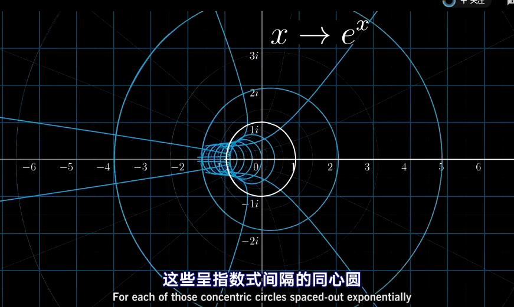

## 定义
群论的核心是了解对称性之间如何互相影响？
- 正方形的八种对称性
- 连续无限多的圆的对称性
- 自己虚构的对称性
## 之间的关系
- 正方形上
先旋转90度，然后沿纵轴翻转==沿着对角线翻转
- 圆上
先旋转270度，紧接着旋转120度，总体和直接旋转30度一样
所以在圆群中，270旋转+120度旋转==30度旋转

总体来说，对于任意一个群，也就是多个对称作用的集合，都存在某种运算，使得作用A+作用B总体效果等于作用C，或者（作用之间相乘）。
即两个作用依次进行等价的单个作用之间的关系，让一组东西变成一个群。
现代数学很大一部分起源与此：起源于理解一系列作用之间的关系，也就是两个作用之和和它们复合后形成的单个作用之间究竟有何联系。
## 群概念
很多不同的概念都能从对称性和对称性的复合构建得到
- 行列式不为0的方阵（线形变换）
- 分子对称性
- 密码学
- 数
两种作用：加和乘。
    - 加相当于滑动，一维的滑动，实数加法群。二维的滑动就是复数加法群。
    - 乘相当于拉伸和放缩，一只手固定原点，另一只手拽着数字1想去哪就去哪。正实数乘数群，作用之间复合乘法。二维平面的乘法群就有拉伸，压缩，旋转的成分，i方向上的分量。
## 不同群之间的关系
函数接收一种作用，并输出另一种作用
#### 幂函数
幂函数，就是将乘法群转换到加法群
- 在幂函数中，代入一个实数，就会得到一个实数，所以指函数接收任一纯水平滑动，并把它转化为纯拉伸或纯压缩作用。
- 所以说，一个合理的做法是，将新的加法作用-上下滑动，直接映射为新的乘法作用-纯旋转
- 一个指数函数$2^x$，将纯竖直滑动映射为纯旋转，它的意思就是将竖直线上的复数，也就是i的倍数，映射成为单位圆上的复数。
- 对于指数函数$2^x$，向上滑动1个单位的数i，碰巧映射为约0.693弧度的旋转，对于指数函数$5^x$，向上滑动1个单位的数i，映射为约1.609弧度的旋转，而指数函数$e^x$，向上滑动1个单位的数i，恰恰映射为1弧度的旋转，向上滑动$\pi$个单位，对应输入$\pi i$，会映射为旋转$\pi$弧度，也就是180度旋转。

#### x到$e^x$的变换（二维平面）
把平面沿着竖直方向卷成一个圆筒，然后把所有竖直的线绕成一个个圆，然后在原点附近，把圆筒拍扁到平面上。

