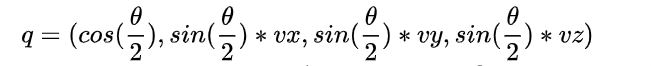
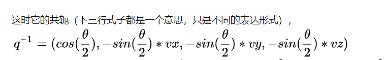
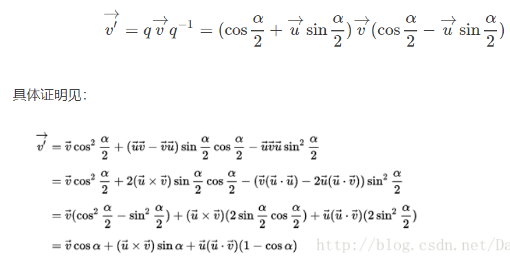
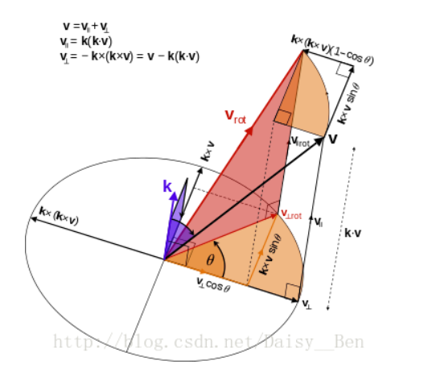
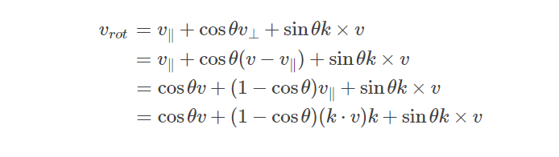
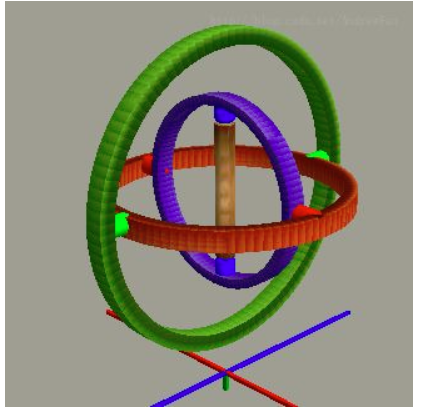
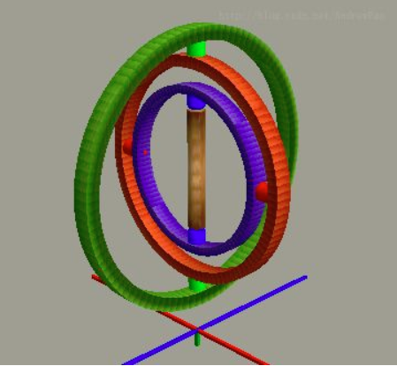

复数平面的旋转
在复数二维平面内，乘以一个复数，相当于对某个复数进行旋转放缩操作
- 旋转的成分取决于复数与实数轴之间的角度
- 放缩的成分取决于两者（实数部分与虚数部分）的平方和根。

## 四元数
四元数仅是3D姿态的一种表达方式，我们用一个单位四元数表达原本用旋转矩阵表示的三维旋转。这样做一个直接的好处是省空间。一个旋转阵有9个分量，但只有三个自由度。那么，能不能用三个数来描述呢？可以是可以的，但不可避免会出现奇异的情况，欧拉角就是一个例子。而四元数，比三维向量多了一个分量，从而可以无奇异地表示各种姿态。下面我们来详细讲讲四元数。

四元数是Hamilton找到的一种扩展的复数。一个四元数拥有一个实部和三个虚部。
- 如果假设某个旋转是绕单位向量$\vec v = (vx,vy,vc)$，进行了角度$\theta$的旋转，那么这个四元数形式为
- 而它的共轭为
- 如果你想算一个点$w = (wx,wy,wc)$在这个旋转下新坐标w'，需要进行如下操作
- 定义纯四元数$qw= (0,wx,wy,wc) = 0+wx*i+wy*j+wz*k$
- 进行四元数运算：$qw' = q*qw*q^{-1}$，产生的qw'一定是纯四元数，也就是它的第一项为0.
- 这样就完成了一次四元数旋转运算

为什么计算四元数时，角度要减半？
- 这是因为q做的就是一个$\frac{\theta }{2} $的旋转，而$q^{-1}$也做了一个$\frac{\theta }{2}$ 的旋转。我们进行了两次旋转，而不是一次，这两次旋转的结果是一个旋转角为$\theta$的旋转。
#### 四元数与其他变换之间的关系
- 四元数转欧拉角
- 欧拉角转四元数
将欧拉角转换为四元数，对四元数进行slerp即球面线性插值，再将这一系列四元数转换为对应的欧拉角，而后作用于角色。缺点是耗费一定的内存，但角色可以任意旋转，灵活度高。
- 四元数转旋转矩阵4*4
#### 四元数旋转与罗德里格斯之间的关系
- 如果空间向量$\vec v$想要绕某一单位向量$\vec u$旋转$\theta$角，则使用四元数法$q = cos\frac{\theta }{2}+\vec{u}sin\frac{\theta }{2}$以及它的共轭四元数与$\vec v$进行汉密顿积得到新的旋转后的新向量：
- 上述等式的最后一行就是下面要说的罗德里格旋转公式
## 罗德里格斯变换
罗德里格旋转公式是计算三维空间中，一个向量绕旋转轴旋转给定角度以后得到的新向量的计算公式。这个公式使用原向量，旋转轴及它们叉积作为标架表示出旋转以后的向量。
==四元数可以很方便地表示旋转变换。但在很多场合中，使用矩阵形式和向量形式表达旋转更有利于推导。==

当处理三维空间时，常常需要用3*3矩阵表征空间旋转。这种方法是最方便的，因为一个向量乘以该矩阵等价于该向量以某种形式旋转。不便之处是不能直观的显示3*3矩阵的旋转含义。

另一个容易可视化的表示方法是用向量来说明绕坐标轴的旋转，向量长度表示绕轴逆时针旋转的角度。
这个很容易实现，由于方向可以用任意长度的向量表示，因此我们选择向量长度表示旋转角度。

上述两种表述的关系是矩阵和向量可以用罗德里格斯变换关联。
- 只是表示旋转的成分，并没有放缩的成分
- 变换公式：

#### OpenCV实现
将旋转矩阵转换为旋转向量，反之亦然。
- cv2.Rodrigues(src[, dst[, jacobian]])-->dst, jacobian
    - src:输入旋转向量(3x1或1x3)或旋转矩阵(3x3)。
    - dst:分别输出旋转矩阵(3x3)或旋转向量(3x1或1x3)
    - jacobian:输出数组分量对输入数组分量偏导数的矩阵
## 附录（万向锁）
万向节：陀螺仪

- 偏航：最内层旋转，yaw晃动，会带动外两层运动,三层没有相对位移。
- 俯仰：中间层的旋转，pitch晃动，会带动最外层运动，与最内层有相对位移。
- 滚筒：最外层的旋转，roll晃动，只有最外层运动，与里面两层都有相对位移。

当旋转到如下状态时，即仰航90度，里面两层重叠了，这时候中间的转子不平衡了，失去了自身的调节功能。

- 红色连接头：可以给予一个相对俯仰的自由度。
- 绿色连接头：可以给予一个相对偏航的自由度。
- 蓝色连接头：可以给予一个相对偏航的自由度。

没错，三个连接头，提供的自由度只对应了俯仰和偏航两个自由度，桶滚自由度丢失了。
