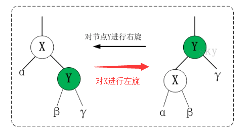

下述的树都是有利于进行查找而设计的一些有特性的树结构。而且都是动态结构的树，查找时间都是在O(logN)数量级，但是每一种都有其存在的必要性。
- 二叉搜索树（Binary Search Tree）
- 平衡二叉树（Balanced Binary Search Tree）
- 红黑树（Red-Black Tree）
- B树（B Tree）
## 二叉搜索树
二叉查找树又称二叉搜索树，二叉排序树，特点如下:
1. 左子树上所有结点值均小于等于父结点
2. 右子树上所有结点值均大于等于父结点
3. 结点的左右子树本身又是一颗二叉查找树
4. 二叉查找树中序遍历得到结果是递增排序的结点序列。
## 平衡二叉树
二叉查找树在最差情况下竟然和顺序查找效率相当，这是无法仍受的。事实也证明，当存储数据足够大的时候，树的结构对某些关键字的查找效率影响很大。当然，造成这种情况的主要原因就是BST不够平衡(左右子树高度差太大)。既然如此，那么我们就需要通过一定的算法，将不平衡树改变成平衡树。因此，AVL树就诞生了。
## 红黑树
二叉平衡树的严格平衡策略以牺牲建立查找结构(插入，删除操作)的代价，换来了稳定的O(logN) 的查找时间复杂度。但是这样做是否值得呢？
能不能找一种折中策略，即不牺牲太大的建立查找结构的代价，也能保证稳定高效的查找效率呢？ 答案就是：红黑树。

红黑树是许多平衡搜索树中的一种，可以保证在最坏的情况下基本动态几何操作的时间复杂度为O(2*logN)
一颗红黑树是满足下面红黑性质的二叉搜索树：
- 每个节点或是红色或是黑色的
- 根节点是黑色的
- 每个叶节点是黑色的
- 如果一个节点是红色的，则它的两个子节点都是黑色的
- 对每一个节点，从该节点到其所有后代节点的简单路径上，均包含相同数目的黑色节点

红黑树的操作
- 旋转操作，插入和删除操作之后，可能违反了红黑的性质，需要改变树中的某些结点的颜色和指针结构。
- 分为左旋和右旋
####  红黑的特点
- 树的最长深度小于等于最小的深度2倍
- 平衡树严格的平衡==红黑树的优点：插入删除之后的非平衡结构都可以在三次旋转之内达到平衡结构。==
## B树
对于在内存中的查找结构而言，红黑树的效率已经非常好了(实际上很多实际应用还对RBT进行了优化)。但是如果是数据量非常大的查找呢？将这些数据全部放入内存组织成RBT结构显然是不实际的。实际上，像OS中的文件目录存储，数据库中的文件索引结构的存储…. 都不可能在内存中建立查找结构。必须在磁盘中建立好这个结构。那么在这个背景下，RBT还是一种好的选择吗？
在磁盘中组织查找结构，从任何一个结点指向其他结点都有可能读取一次磁盘数据，再将数据写入内存进行比较。大家都知道，频繁的磁盘IO操作，效率是很低下的(机械运动比电子运动要慢不知道多少)。显而易见，所有的二叉树的查找结构在磁盘中都是低效的。因此，B树很好的解决了这一个问题。
