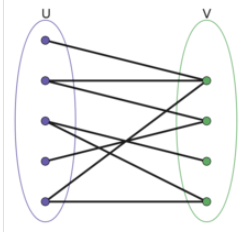

## 定义
一个二分图G= (V,E)，结点集划分为两个互不相交的子集（L,R）即V= L U R，并且图中的每条边(i,j)所关联的两个顶点分别属于这两个不同的顶点集，则称图G为一个二分图。

## 相关算法
#### 最大匹配
给定一个二分图G，在G的一个子图M中，M的边集中任意两条边都不依附于同一个顶点，则称M是一个匹配，选择这样的边数最大的子集称为图的最大匹配问题。

上述问题就是一个匹配问题，常用的求解算法是增广路径算法，此处省略，有兴趣的可以自行google。
