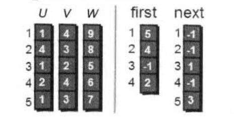

## 只有五行的Floyd-Warshall（弗洛伊德）
背景：需要求任意两个城市之间的最短路程，也就是任意两个点之间的最短路径。

这个问题也被称为“多源最短路径”问题，即求解任意两个点之间的最短路径。

怎样求解问题？之前的学习我们知道通过BFS，DFS求取两个点之间的最短路径。所以进行(N*N)遍深度或广度优先搜索，便可以求取任意两点之间的最短路径，但是这个算法太暴力，有没有其他的算法？

根据以往经验，如果想让任意两点之间的距离变短，只能引入第三点（顶点k），并通过这个顶点k，即a-->k-->b，才可能缩短从顶点a到顶点b的路径。

但是中转k是哪个点呢？甚至有时候不只通过一个点，而是经过两个或者多个点会更短。

当任意两点之间不允许经过第三点时，这些城市之间的最短路径就是初始路程。
- 假设先值允许经过1号点，求任意两点之间的最短路径，求解代码如下。
- 接下来继求经过1,2号两个顶点情况下任意两点之间的最短路程，即在经过1号更新之后的路程结果再应用经过2；号顶点
- 依次进行，直至到n号顶点，即允许经过1-n号所有顶点进行中转。
#### 假设只允许经过1号顶点的示例
这个算法是，只允许经过1号点的任意两点之间最短路径，如果小于两点直接的路径，就更新两点直接的路径，反之，不更新距离。
e[i][1]+e[1][j]表示从i号顶点先到1号顶点，再从1号顶点到j号顶点的路程之和。
更新所有点与点之间的距离。
```c
for (i = 1;i<=n;i++)
{
  for(j=1;j<=n;j++)
  {
    if(e[i][j]>e[i][1]+e[1][j])
      e[i][j] = e[i][1]+e[1][j];
  }
}
```
## Dijkstra算法-通过边实现松弛（戴克斯特拉）
==通过边松弛==
Dijkstra是一个指定点到其余各个顶点的最短路径，也叫“单源最短路径”，例如一个有6个顶点的图，求取1号顶点到2,3,4,5，6号顶点的最短路径。
- 松弛：在dst数组中，我们发现dis[3] = 12,dis[2]+e[2][3] = 1+9 = 10,dis[3]>dis[2]+e[2][3],因此dis[3]要更新为10，这个过程就叫做松弛。

求解过程
- 首先将其余点到1号点的初始距离存储在dis数组中
- 既然是求1号顶点到其余各个顶点的最短路径，那就先找一个离1号顶点最近的顶点，通过数组dis可以求出是2号点
- 接下里看看2号点有哪些出边：2-->3,2-->4两条边，讨论一下通过2-->3这条边能否让1号顶点到3号顶点的距离变短即dis[3]和dis[2]+e[2][3]之间的大小，如果下就更新
- 同理计算2-->4，对2号顶点所有的出边进行了松弛
- 对2号顶点边松弛之后，继续选择剩下的3,4,5,6号顶点的离1号顶点距离最近的点，然后按照上述过程，对其出边进行松弛
- 直到所有的点都被松弛过

#### 核心算法
```c
for(i=1;i<=n;i++)
{
  //找到离1号顶点最近的顶点
  min = inf;

  for(j=1;j<=n;j++)
  {
    if(book[j]==0&&dis[j]<min)
    {
      min = dis[j];
      u = j;
    }
  }

  book[u] = 1;

  for(v=1;v<=n;v++)
  {
    if(e[u][v]<inf)
    {
      if(dis[v]>dis[u]+e[u][v])
        dis[v] = dis[u]+e[u][v];
    }
  }
}
```
如果使用邻接表来实现的话，可以使用三个数组来存储一条边的起点，终点，权值。first数组的第i个元素存储顶点编号为i的第一条边的序号，next[i]存储编号为i的边的下一条边号。
## Bellman-Ford-解决负权边
Dijkstra算法虽然好，但是它不能解决负权边问题的图，即将要介绍的算法无论是思想上还是代码上都堪称完美，它就是：Bellman-Ford算法。其核心代码只有四行。

```c

//读入边
for(i=1;i<m;i++)
  scanf("%d %d %d",&u[i],&v[i],&w[i])
```
==这里使用邻接表来存储图，u数组表示起点，v数组表示终点，w数组便是u到v的权重==
第i条边存储在u[i],v[i]和w[i]中，表示从顶点v[i]到v[i]这条边权值为w[i].
- 在外循环的第一次循环中，我们对所有的边进行松弛，操作之后，有的距离更新了，有的没有更新
- 我们进行第二次更新，发现上一次没有更新的距离这次更新了
- 换句话说，在第一轮对所有边进行松弛之后，得到的是从1号顶点“只能经过一条边”到达其余个顶点的最短路径长度。第二轮在对所有的边松弛之后，得到的是从1号顶点“最多经过两条边”到达其余个顶点的最短路径长度。如果进行k轮的话，得到的就是1号顶点“最多经过k条边”到达其余各顶点的最短路径长度，进行k-1轮就行了。
#### 核心代码
```c
for(k=1;k<n-1;k++)
  for(i=1;i<=m;i++)
    if(dis[v[i]]>dis[u[i]]+w[i])
      dis[v[i]] = dis[u[i]]+w[i];
```
此外这个算法可以检测负权回路，在进行了n-1轮松弛之后，仍然可以继续成功松弛，说明必然存在负权回路。如果一个图没有负权回路，那么最短路径所包含的最多n-1条边，即进行n-1轮松弛之后最短路不会发生变化。
## Bellman-Ford的队列优化
在每一次实施松弛算法操作之后，就会有一些顶点已经求得最短路。此后这些顶点的最短路估计就会保持不变，不再受后续松弛操作的影响，但是每次还要判断是否需要松弛，浪费时间。我们可以使用队列优化来对算法进行优化。
