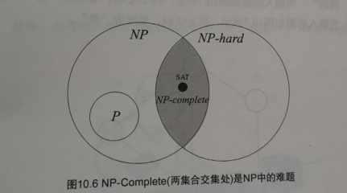

## P问题
在多项式时间内解决的问题
## NP问题
就是能在多项式时间内验证答案正确与否的问题

## NP-hard问题
如果一个问题仅满足NP-完全的第二个条件且可能为NP问题也可能不是NP问题时，就被称为NP-难问题。
## NP完全问题
满足两点
- 是NP-hard问题
- 是NP问题

如果对于一个问题存在一个$O(n^c)$时间的算法，其中c为常量，那么对于所有问题均能找到一个$O(n^c)$时间的算法。我们称这些问题为NP-完全问题
## 三者之间的关系

