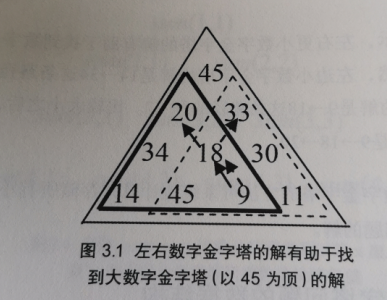
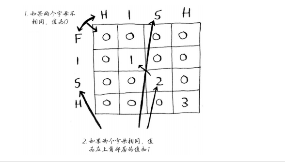
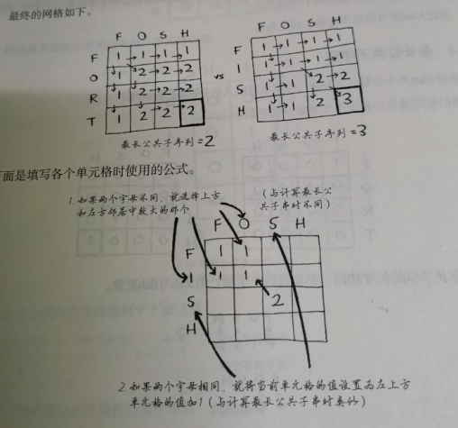

## 数字三角形
由数组组成的三角形，找出顶部到底边的路径最大，只能往左下或者右下走

直角三角存储，转化为正下方或者右下方
用二维数组存放三角形
D(r,j):第r行第j个数字
Maxsum(r , j)：从D(r,j)到底边的各条路径中，最佳路径的数字之和。

典型的递归问题：
- 从Drj出发，下一步只能走Dr+1j或者Dr+1j+1
if (r==n)
	Maxsum(r,j) = Drj
else
	Maxsum(r,j) = Max(Maxsum(r+1,j),Maxsum(r+1,j+1))+D(r,j)

递归容易造成重复计算，所以需要两种方法，一个是递归算法，一个是递推算法！
- 生成一个多维数组用来表示各个阶段的解，递归调用，如果用到了，直接索引就行。
- 生成一个多为数组用来表示各个阶段的解，递推生成整个数组。
## ==最长上升子序列==
找子问题（限定终点，以每一个元素定量的分析）
- 求以ak（1,2,...n）为终点的最长上升子序列的长度
- 一个上升子序列中最右边的那个数，称为该序列的终点
- 子问题只和一个变量--数字的位置有关

状态转移方程：
maxLen（1） = 1
maxLen（k） = max{ maxLen(i): 1<=i<=k ,且ai<ak且k !=1}+1
maxLen(k)的值，就是在ak左边，终点数值小于ak，且长度最大的那个上升子序列的长度再加1.若找不到，则为1。
```
首先初值全部赋值为1
for(int i = 2 ;i<=N;i++)
	for(int j = 1;j<i;j++)
		if(a[i]>a[j])
			maxLen[i] = max(maxLen[i],maxLen[j]+1)
```
## 最长公共子串
就是一个子字符串
与公共子序列大致相似，else的处理不同。
需要注意一点的是，这个问题的最终答案不在最后一个单元格中！对于背包问题，最终答案总是在最后的单元格中。但对于最长公共子串问题，答案为网格中最大的数字---它可能并不位于最后的单元格中。
```py
if word_a[i] == word_b[j]:
	cell[i][j] = cell[i-1][j-1]+1
else:
	cell[i][j] =0
```
## 最长公共子序列
两个字符串最长的公共子序列：子序列中每个字符都能在两个原串中找到，而且每个字符的先后顺序和原串中先后顺序一致。

MaxLen( i , j ):
- s1的左边的 i 字符形成的子串，与s2的左边的 j 个字符形成的最长公共子序列长度。
- 初始边界：maxLen(n,0) = 0;maxLen(0,n) = 0

状态转移方程
if(s1[i-1]==s2[j-1])
	maxLen(i,j) = maxLen(i-1,j-1)+1
else
	maxLen(i,j) = max(maxLen(i-1,j),maxLen(i,j-1))

```c
for(i = 0;i<=len1;i++)
	maxLen[i][0] = 0
for(j = 0;j<=len2;j++)
	maxLen[0][j] = 0
for(i  =1;i<=len1;i++)
	for(j=1;j<len2;j++)
		if(s1[i-1]==s2[j-1])
			maxLen[i][j] = maxLen[i-1][j-1]+1;
		else
			maxLen[i][j] = max(maxLen[i-1][j],maxLen[i][j-1]);
cout<<maxLen[len1][len2]<<endl;
```
## 最佳加法表达式
由1-9组成的字符串，问如果将m个加号插入到数字串中，在各种可能形成的表达式中，值最小的那个表达式的值是多少？

子问题
- 将最右边的数字放在第i个数字后面，那么整个表达式的最小值，就等于在前i个数插入m-1加号能形成的值最小
- V(m,n)表示在n个数字中插入m个加号所能形成的表达式最小值。
- if (m=0)：V(m,n)就是整个字符串组成的数值
- elseif (n<m+1) 非法无穷大
- else：V(m,n) = min{ V(m-1,i)+Num(i+1,n) } (i = m...n-1)
