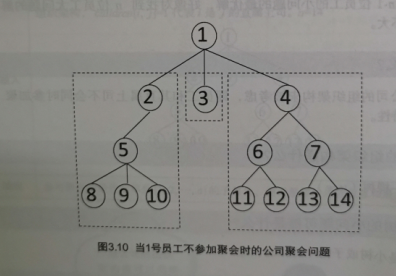
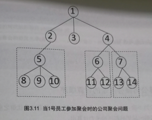

## Help Jimmy
## 滑雪
广搜动规
mike喜欢滑雪，为了获得速度，滑的区域必须向下倾斜，而且当你滑到坡底，你不得不再次走上破等待升降机载你
mike想知道在一个区域里的最长的滑坡，区域由一个二维数组给出，数组的每个数字代表高度，一个人可以从某个点向上下左右相邻的四个点，当且仅当高度减小，才可以被视为滑道，输出最长区域的长度。
 - 子问题：L(i，j)表示从（i，j）出发的最长滑行长度，一个点如果周围没有比它的点，那么L(i,j) = 1
 - 将所有点按高度排序，从小到大遍历所有的点，经过一个点（i,j）,就用递归公式求L（i，j）
 - $if H(i+1,j)>H(i,j):L(i+1,j) = max(L(i+1,j),L(i,j)+1)$
## 神奇的口袋
有一个神奇的口袋，总的容积是40，用这个口袋可以变出一些物品，这些物品的总体积必须是40.
小明现在有n个想要的物品，每个物品的体积是ai。小明可以从这些物品中选择一些，如果选出的总体积是40，那么利用这个神奇的口袋，小明就可以得到这些物品。现在问题是，小明有多少种不同的选择物品的方式？
输入的第一行是正整数n，表示不同的物品的数目。
- 子问题：从前k种物品选择一些，凑成体积w的做法的数目way[w][k]
- 递推就是针对第k种物品，选还是不选？：$way[w][k] = way[w][k-1]+way[w-a[k]][k-1]$
## 0-1背包问题
- F[i][j]表示取前i种物品，使得总体积不超过j的最右取法的价值总和。
- 递归(取第i种物品和不取第i种物品)：
```c
F[i][j] = F[i-1][j]
if j>=w[i]:
F[i][j] = max(F[i-1][j] , F[i-1][j-w[i]]+v[i])$
```
## 分蛋糕

## 换零钱问题
硬币种类面额为：33,24,12,5,1
定义一个函数f(n)代表金额为n的最少的硬币数，则下列等式是正确的：`f(36) = min{1+f(36-33),1+f(36-24),1+f(36-12),1+f(36-5),1+f(36-1)}`
## 公司安排聚会
公司安排聚会，为了使聚会成功，认识部门使用分数评估每位员工为聚会带来快乐的程度，另外为了聚会有愉快的气氛，员工和直属上司不会同时参加，请设计一个算法，使得聚会的快乐分数总和最大。
- 什么是最优子结构性质
检查是否大问题的最优解可以利用小问题的最优解组合得到
- 若在公司找出n为员工是大问题，小问题是什么？
已知n-1为员工的小问题的最优解，好像对找到n位员工的大问题解帮助不大
- 为什么？
因为公司的组织架构未被考虑，即员工和直属上司不会同时参加聚会的特性。
- 公司的架构是什么？
就像一棵树
- 一棵树的小问题是什么？
应该是小树或者子树吧



> Written with [StackEdit](https://stackedit.io/).
<!--stackedit_data:
eyJoaXN0b3J5IjpbLTEyNjU2OTk5NDRdfQ==
-->
