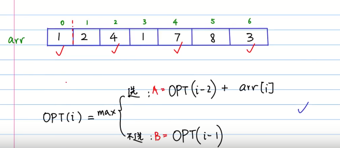
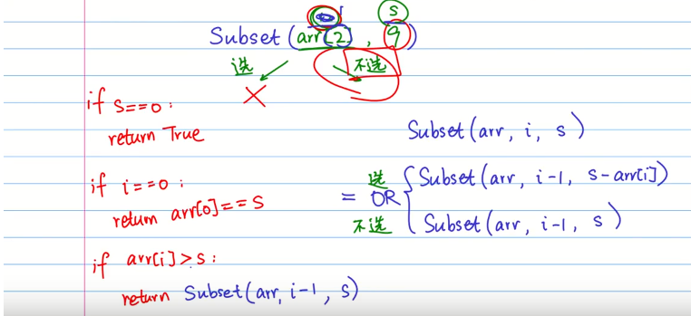
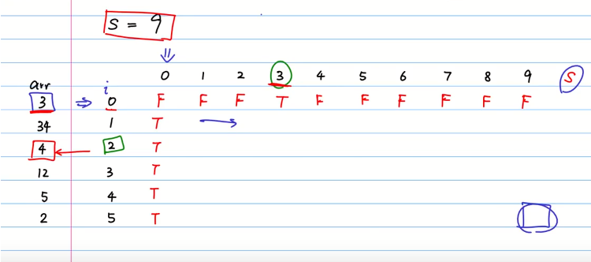

==问题的穷举搜索的思路对于每个元素也是选或者不选。==
## 例题1
在一个数组中，找出一组不相邻的数字，使得最后的和最大
分阶段，有选和不选的两种选择
- OPT（n）：数字到下标为6的地方的最佳方案
- 对于每一个阶段比如OPT（6），第六个数字，有两个可能，选他，不选他；选他：OPT（6） = OPT（4）+arr[6];不选他：OPT(5)
- OPT=max(OPT（4）+arr[6],OPT(5))
- OPT(i) = max(OPT(i-2)+arr[i],OPT(i-1))
- 边界：OPT(0) = arr[0],OPT(1) = max(arr[0],arr[1])

```py
def rec_opt(arr,i):
    if i==0:
        return 0
    elif i==1:
        return max(arr[0],arr[1])
    else:
        return max(rec_opt(arr,i-2)+arr[i],rec_opt(arr,i-1))
rec_opt(arr,6)
```
```py
def dp_opt(arr,i):
    opt = np.zeros(len(arr))
    opt[0] = arr[0]
    opt[1] = max(arr[0],arr[1])
    for i in range(2,len(arr)):
        A = opt[i-2]+arr[i]
        B = opt[i-1]
        opt[i] = max(A,B)
dp_opt(arr)
```
## 例题2
给定一个正整数val，判断一个数组arr中，是否有一组数字加起来等于val。
- 对于每个数字都有选和不选两种选择！
- Subset(i,S):i表示看第i个数字，S表示加出来的数字
- Subset(5,9):选第五个数字，选的话：Subset(arr[4],9-arr[5]);不选的话：Subset(arr[4],9)，中间用or连接起来
- 出口边界条件
- S==0,return True;
- 当i等于0时，S不等0,return arr[0]==S。
- 当arr[i]>S: return Subset(arr[i-1],S)

```py
arr= [3,34,4,12,5,2]
def rec_subset(arr,i,s):
    if s==0:
        return True
    elif i==0:
        return arr[0]==s
    elif arr[i]>s:
        return rec_subset(arr,i-1,s)
    else:
        A = rec_subset(arr,i-1,s-arr[i])
        B = rec_subset(arr,i-1,s)
        return A or B
rec_subset(arr,len(arr)-1,9)
```

```py
def dp_subset(arr,s):
    subet = np.zeros(len(arr),s+1)
    subset[:,0] = True
    subset[0,:] = False
    subet[0,arr[0]] = True
    for i in range(1,len(arr)):
        for s in range(1,s+1):
            if arr[i]>s:
                subset[i,s] = subet[i-1,s]
            else:
                A = subset(i-1,s-arr[i])
                B = subset(i-1,s)
                subset[i,s] =  A or B
    r,c = subset.shape
    return subset[r-1,c-1]
```
