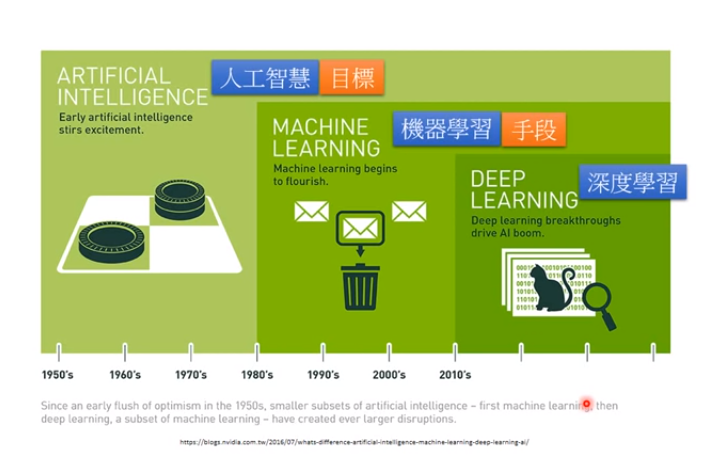
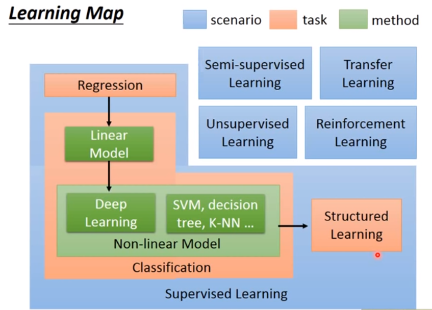
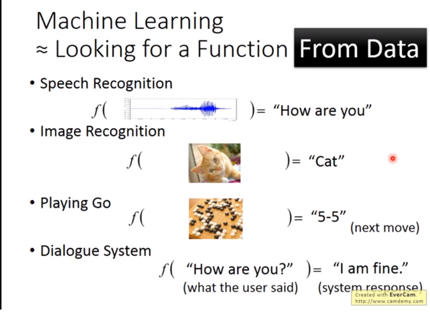

## 总括

## Learning Map

## 机器学习
==Looking for a Function ==

机器学习就是人类定义的一定的计算机算法，让计算机根据输入的样本和一些人类干预得来的总结并归纳其特征和特点，并利用这些特征和特点形成映射关系，进而自动化做出相关反映的过程
- 人类输入给模型的学习样本都是经过高度提炼的向量内容，而不能像我们在深度学习那样，直接把一张图，一段语音，一段视频丢给机器学习。
- 有很好的解释性，直到模型在做什么，处理的是什么特征，需要的数据量一般较小。
## 深度学习
基于深度神经网络的学习，神经网路进行学习的过程。
- 没有解释性，需要的数据量一般较多
- 数据信息特征难以提取
- 数据承载的信息难以提取和量化
- 不需要提取特征
- 处理线性不可分问题
- 强大的空间划分能力
