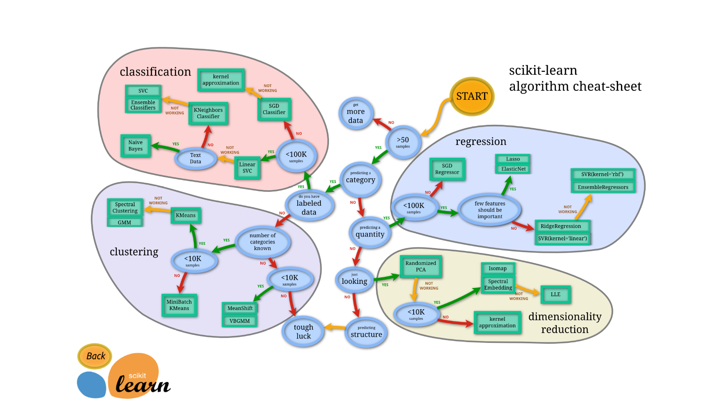
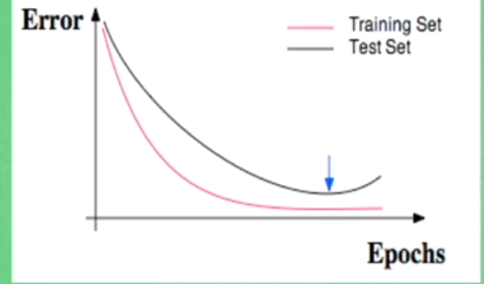

## 流程图

## 数据集的网址
https://scikit-learn.org/stable/modules/classes.html#module-sklearn.datasets
## 通用学习模式
大部分的模型的处理学习过程都是相似的

## model常用属性
- fit：就是训练学习
- coef_ ：输出变量系数
- intercept_：常数系数
- predict：预测模型
- get_params：拿出之前定义的参数，{'copy_X': True, 'fit_intercept': True, 'n_jobs': None, 'normalize': False}
- score：将预测出的数据与实际数据对比，得分，R^2的形式打分。
## normalization 标准化数据
特征之间的跨度或者说是范围，就需要使用normalization
## 怎样检验神经网络
训练数据：0.7，测试数据：0.3
评价机器学习，随着时间变长，误差变小
f1分数：测量不均衡数据的精度
R2：测量回归问题精度
下图就是过拟合的形式：
- 
- 解决方法：增加数据量，正则化，或者dropout方法

#### regularzation：正则化
L1，L2
L2:即所有的权重的平方和，后面部分是惩罚机制
L1：所有权重的绝对值的和，abs

####交叉检验
分类：accuracy
回归：mean_squared_error

过拟合：high variable
欠拟合：high bias
解决办法；怎么去看overfiting的问题
使用learning_curve取可视化学习过程，怎样降低误差（loss）
cv = N:意思就是将数据分为10份，依次选取某个部分作为测试集，其余的作为训练集！
#### dropout

## Save模型
- pickle模块将类型对象直接存储起来，加载取来可以是一个对象然后直接使用。
- joblib：joblib.dump(clf,"clf.pkl"),运用多进程，存储数据会很快，相对于pickle模块。
