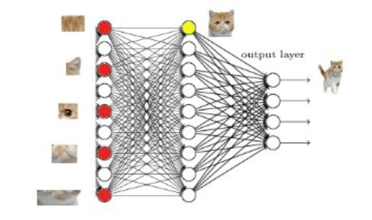

应用的场景对象是图片，那么中间的架构就经常用到卷积层。
计算机图片识别，识别分析，药物发现。

卷积时对每一块区域做处理，加强图片的整体理解，就像一个过滤器，搜集信息，收集的信息来进行整体。

过滤器收集小批像素块，能使网络看到图形，而非一个点，收集的值，首先看见边缘信息，然后从边缘信息，总结出鼻子，眼睛等高一层的信息，然后脸部的信息被总结出来。
## 什么时候可以使用CNN
- 一些小的pattern比整张图小。
- 有相同的patterns出现在不同的区域，代表相同的意义。
- 下采样不会改变图片的样子（人看到的）
## 怎么理解卷积CNN
==最底层的一般是提取线条的特征，各个方向，长度，宽度等等，人类和CNN理解的世界是不一样的。==
- 图片中pattern一般是图片中比较小的，不需要看整张图片。
- 第一层的layer就是侦测某一种pattern，比如一个neural，他要看某个pattern有没有出现，它不要看整张图片，而是看一小部分。
- 比如检测鸟的话，一个neur侦测鸟嘴，另一个侦测鸟翅膀等等。
- 每一个neural只需要连接到一小块区域就好，不需要连接到整张的图片。
- 同一个pattern可能出现在图片中的不同区域，但是代表同样的含义，所以可以共用参数，所以就采用滑动的操作。
- 最后做Flatten，然后丢到全连接网络中去分类即可。
## 卷积+pooling？
卷积核池化结合可以更好的保留原图片信息。
- 因为如果跨2步卷积图片，会丢失重要信息
- 所以跨步保持1，更好的理解图片，然后再进行池化，来缩小长宽。
## 全连接层
当我第一次看到这个全连接层，我的第一个问题是：
它是怎么样把3x3x5的输出，转换成1x4096的形式

很简单,可以理解为在中间做了一个卷积

从上图我们可以看出，我们用一个3x3x5的filter 去卷积激活函数的输出，得到的结果就是一个fully connected layer 的一个神经元的输出，这个输出就是一个值。

==因为我们有4096个神经元，我们实际就是用一个3x3x5x4096的卷积层去卷积激活函数的输出。==

这一步卷积有一个非常重要的作用，就是把分布式特征representation映射到样本标记空间。就是把特征representation整合到一起，输出为一个值。
- 这样做，有一个好处，就是大大减少特征位置对分类带来的影响。
#### 举例
从上图我们可以看出，猫在不同的位置，输出的feature值相同，但是位置不同。

对于电脑来说，特征值相同，但是特征值位置不同，那分类结果也可能不一样。

而这时全连接层filter的作用就相当于喵在哪我不管，我只要喵。于是我让filter去把这个喵找到。
实际就是把feature map 整合成一个值，这个值大
。哦，有喵；这个值小，那就可能没喵，和这个喵在哪关系不大了有没有，鲁棒性有大大增强了有没有。

因为空间结构特性被忽略了，所以全连接层不适合用于在方位上找Pattern的任务，比如segmentation
#### 为什么全连接有两层？
泰勒公式都知道吧，意思就是用多项式函数去拟合光滑函数。我们这里的全连接层中一层的一个神经元就可以看成一个多项式。我们用许多神经元去拟合数据分布，但是只用一层fully connected layer 有时候没法解决非线性问题。而如果有两层或以上fully connected layer就可以很好地解决非线性问题了。

我们都知道，全连接层之前的作用是提取特征，全连接层的作用是分类

如上图所示，红色的神经元表示这个特征被找到了（激活了）。同一层的其他神经元，要么猫的特征不明显，要么没找到;当我们把这些找到的特征组合在一起，发现最符合的就是猫了。

我们再接着往前走一层，那我们现在要对子特征分类，也就是对猫头，猫尾巴，猫腿进行分类，比如我们现在要把猫头找出来。于是我们下一步的任务，就是把猫头的这么些子特征找到，比如眼睛啊，耳朵啊。
当我们找到这些特征，神经元就被激活了（下图红色圆圈）

## 比较一般的结构卷积网络

1. 卷积
2. 池化
3. 卷积
4. 池化
5. 全连接
6. 全连接
7. 分类
