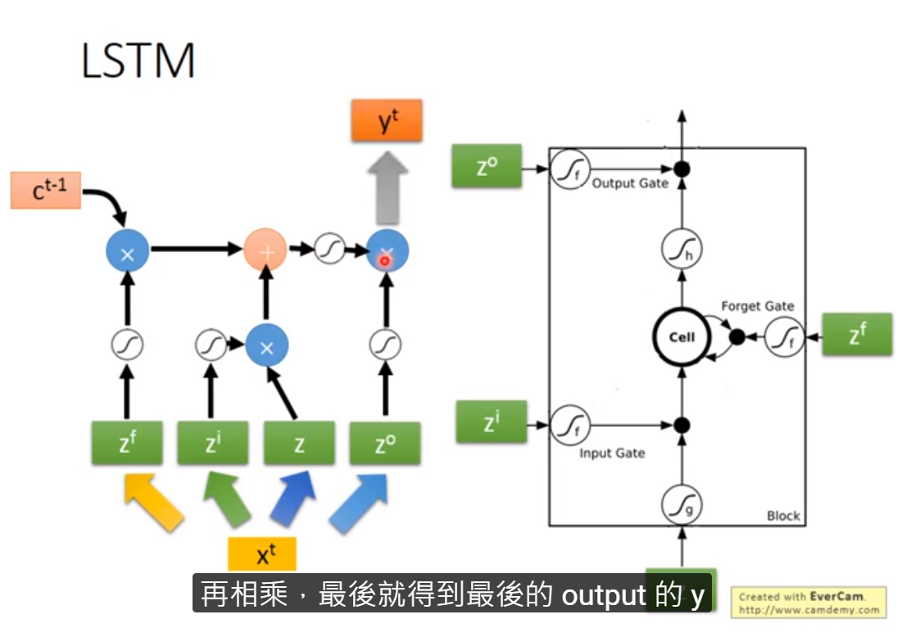

具有记忆功能，序列模型的构建，
Vanilla RNN--》LSTM--》GRU
应用范围：视频序列，区域序列，文本序列
研究问题：图片的描述，问答，机器翻译。
## 和前馈网络不同的是
有一些记忆功能，把过去输入的内容所所产生的远期影响向量化后与当前时间输入的内容一起反应到网络中参与训练。
==输入是时间序列的点值==
## 概念
网络里面加入了memory，用于存储一些当前时间的状态，然后存入memory中，用于下一个时间点的影响因子。

还可以是双向的，单向是从句首读到句尾。也可以读取数值。双向的就是可以参考前一时间点，也参考了后一时间点。

memory里面的值每一个时间点都会被更新，被读取。

#### Elman Network
把隐藏层的值存起来，下一个时间节点，把存起来的值读出来，再得到输出。
#### Jorddan
存的是输出值（输出值），下一个时间点，再读进去。
## LSTM（Long Short-term Memory）
三个gate，所以有四个input，最后得到一个output。
即输入input：Z，input gate：Zi，output gate：Zo，Forget gate：Zf。
- input gate
写入memory时，有一个input gate闸门，只有打开的时候，才能被写入，关闭的时候，不能写入memory，当然输入门关闭时，也不会对输出值产生影响。
- output gate
读取memory的值，之后在闸门打开时，才能被读取，关闭的时候，就没有办法读取。
- Forget Gate
选择时候时候忘记memory里面的数值，如果这个信号触发了，那么里面的值就被忘记了。

与其他神经网络的区别，其他的神经网络有很多的weight，而lstm是cell。
## LSTM流程

最终版的LSTM

多层的LSTM

## 三种类型的RNN
LSTM已经是RNN的一种标准
- LSTM
- GRU：两个gate，少了1/3参数，不容易overfitting
- SimpleRNN
## 系数
两个待定系数
- Wx：与输入向量做乘积，作为输入的一部分
- Wh：由前一次的输出H(t-1)和Wh相乘得到，前一次计算输出需要缓存一下
- 输出Y：由前面输入的H(t-1)和Wh相乘得到的结果与Wx与Xt相乘的结果相加后做SOFTMAX得到
