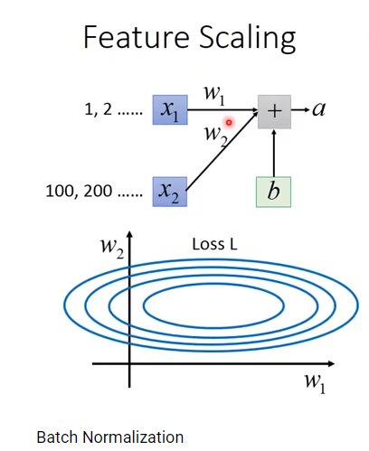
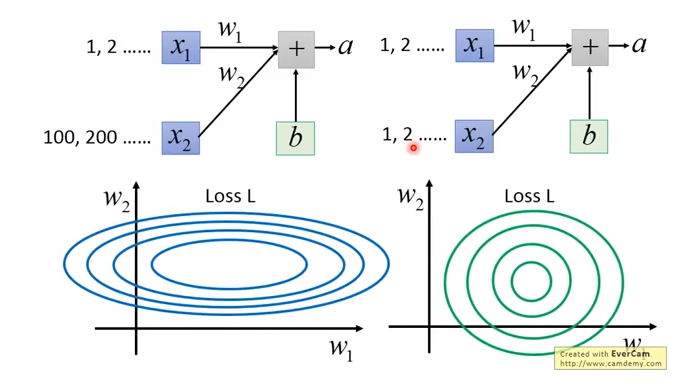
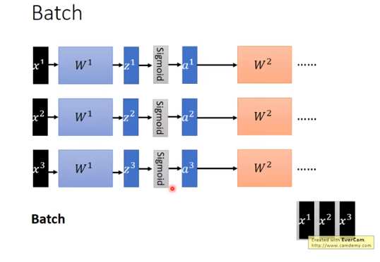
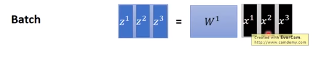
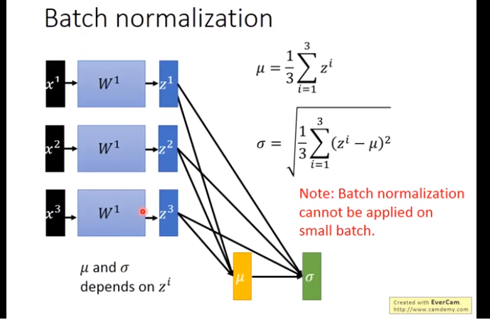
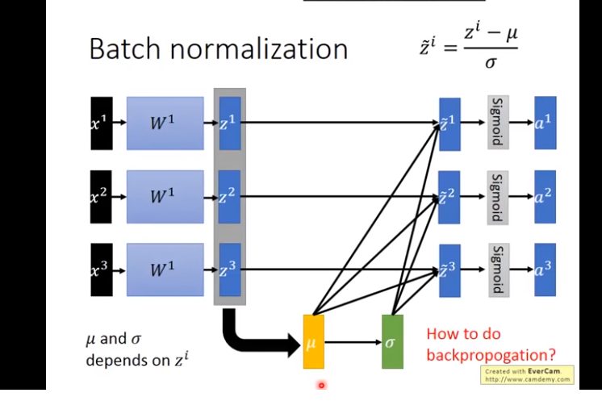

对于深度来说，数据在模型中训练是一个复杂的过程，即使训练模型网络的前面几层发生了非常小的变化，随着梯度下降算法的计算，这个微小的变化在后面几层也会被累计放大下去

==当数据输入的属性分布发生改变时，即使很小的变化，在传递这个变化的过程时，网络的后端也会产生非常大的变化，Batch_Normalization是一种新近的对数据差异性进行处理的手段。当数据的维度的量度差别很大时，需要将数据来进行Batch_Normalization，得到各个维度符合球体的形状。==
## Feature Scaling

making different features have the same scaling。
x1和x2的scale差别很大。
w1和w2对应loss关系，就像是椭圆。
w1方向对结果的影响比较小，w2对结果的影响比较大。==也导致了不同方向的学习速率（learning rate是不一样的）==

而BN就是要达到下面的效果，不同方向的learning rate达到相同的效果。

#### 归一化
对所有的层的输出都做归一化处理。
这是需要知道mean和std的数值，但是这样在深度学习中是比较难获取的。
一个解决办法就是使用Batch Normalization。
## 什么是batch

GPU加速原理

## batch normalization

