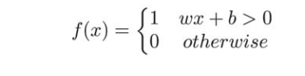

## 感知机

输入一个x，输出1或0，这就是最基础的感知机
## 多层感知机-（MLP）
多层感知机是稠密的（Dense）意味着每一层的神经元都与前一层的全部神经元连接。
## 多层感知机的训练问题
由于多层感知机输出不是1就是0，所以没有中间状态的变化，只有很大的输出阶跃，我们不能够渐进的学习（而不是尝试所有可能的方向——一个被称为彻底搜索的过程，不知道我们是否有提高），毕竟小孩子也是一步一步学习的。

我们需要一些不同的，更平滑的输出，我们需要一个函数能够在0和1之间产生变化，数学上我么需要一个连续的函数能够允许我们微分求导。
