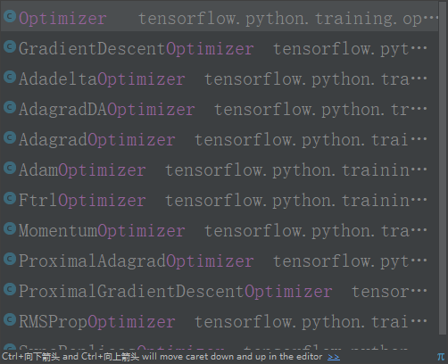

优化器optimizer加速神经网络，主流的方法是：
- SGD
- Momentum：惯性原则，考虑了上一步的learning rate的变化，纠正的速度非常快。
- AdaGrad：学习率上改进
- RMSProp：部分结合Momentum+AdaGrad
- Adam：完全结合Momentum+AdaGrad
## tensorflow下优化器

- Stochastic Gradient descent：tf.train.GradientDescentOptimizer
- Momentum：tf.train.MomentumOptimizer
- Adagrad:tf.train.AdagradOptimizer
- Adadelta：tf.train.AdadeltaOptimizer
- RMSProp:tf.train.RMSPropOptimizer
- Adam：tf.train.AdamOptimizer
- Ftrol：tf.train.FtrlOptimizer
