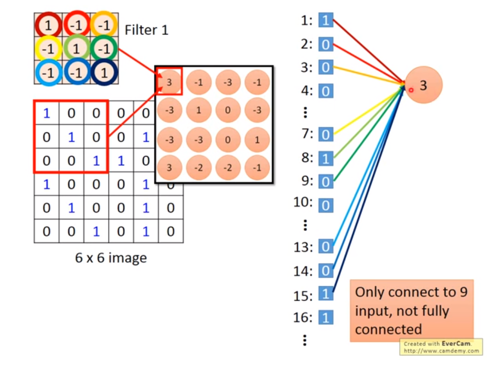
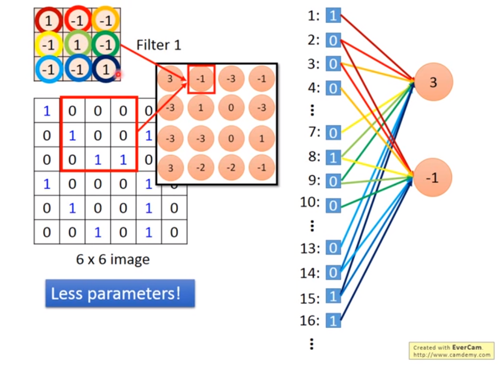

如果将一张图片变为一维向量，然后进行矩阵相乘的操作，那么这一层的网络类型就是全连接型的，而不是卷积型的（将所有的输入都作为输入）。

- 图片中pattern一般是图片中比较小的，不需要看整张图片。
- 第一层的layer就是侦测某一种pattern，比如一个neural，他要看某个pattern有没有出现，它不要看整张图片，而是看一小部分。
- 比如检测鸟的话，一个neur侦测鸟嘴，另一个侦测鸟翅膀等等。
- 每一个neural只需要连接到一小块区域就好，不需要连接到整张的图片。
- 同一个pattern可能出现在图片中的不同区域，但是代表同样的含义，所以可以共用参数，所以就采用滑动的操作。
- 最后做Flatten，然后丢到全连接网络中去分类即可。
## CNN VS FC

- 在全连接中，weights是和36个像素连接的，而卷积中weights减少，只考虑9个。
- 在全连接中，weights是不同的，而卷积找那个weights是共享的。

## 怎么理解全连接
对于目前的卷积神经网络来说，卷积层作为特征提取的手段，在输出最后都是由全连接层做数据的分类层。
因此也可以说全连接层在卷积神经网络中起到一个分类器的作用，从数学的角度解释，全连接层起到一个投影空间映射的作用，将提取的数据特征从一个特征空间投射到不同的特征空间，低维到高维。
但在实际应用中，神经网络训练后的权重都是在全连接中，因此现在的趋势是将全连接层由卷积层代替。
