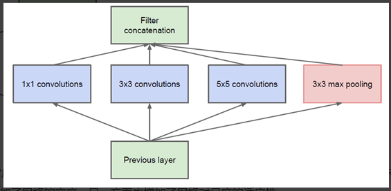
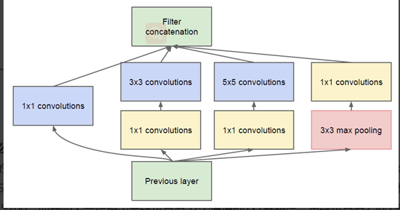
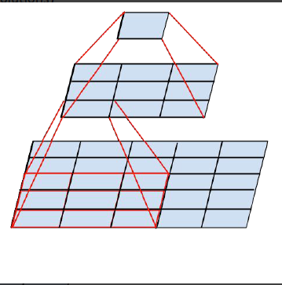
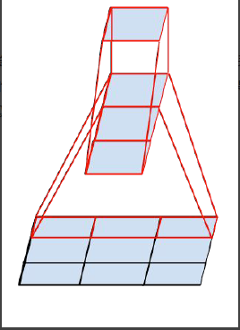
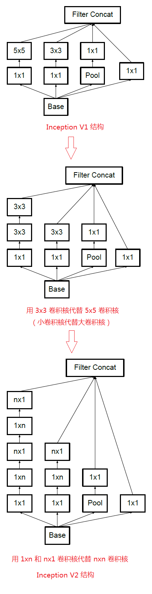
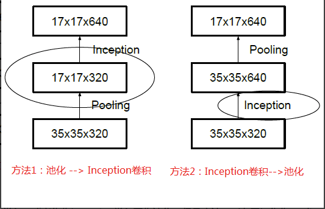
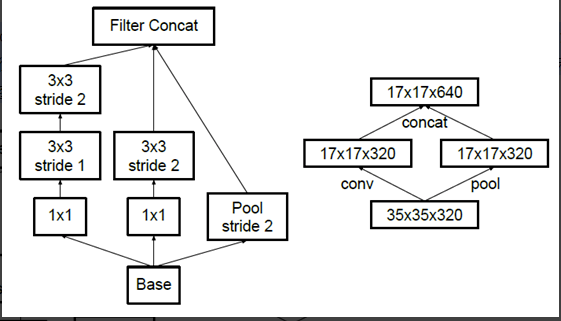

参考：https://my.oschina.net/u/876354/blog/1637819
一般来说，提升网络性能最直接的办法就是增加网络深度和宽度，深度指网络层次数量、宽度指神经元数量。但这种方式存在以下问题：
1. 参数太多，如果训练数据集有限，很容易产生过拟合；
2. 网络越大、参数越多，计算复杂度越大，难以应用；
3. 网络越深，容易出现梯度弥散问题（梯度越往后穿越容易消失），难以优化模型。
所以，有人调侃“深度学习”其实是“深度调参”。
## Inception V1
通过设计一个稀疏网络结构，但是能够产生稠密的数据，既能增加神经网络表现，又能保证计算资源的使用效率。谷歌提出了最原始Inception的基本结构：

然而这个Inception原始版本，所有的卷积核都在上一层的所有输出上来做，而那个5x5的卷积核所需的计算量就太大了，造成了特征图的厚度很大，为了避免这种情况，在3x3前、5x5前、max pooling后分别加上了1x1的卷积核，以起到了降低特征图厚度的作用，这也就形成了Inception v1的网络结构，如下图所示：

1x1的卷积核有什么用呢？
1x1卷积的主要目的是为了减少维度，还用于修正线性激活（ReLU）。比如，上一层的输出为100x100x128，经过具有256个通道的5x5卷积层之后(stride=1，pad=2)，输出数据为100x100x256，其中，卷积层的参数为128x5x5x256= 819200。而假如上一层输出先经过具有32个通道的1x1卷积层，再经过具有256个输出的5x5卷积层，那么输出数据仍为为100x100x256，但卷积参数量已经减少为128x1x1x32 + 32x5x5x256= 204800，大约减少了4倍。
#### 示例代码
```py
def inception_block(x, f):
    t1 = Conv2D(f[0], 1, activation='relu')(x)

    t2 = Conv2D(f[1], 1, activation='relu')(x)
    t2 = Conv2D(f[2], 3, padding='same', activation='relu')(t2)

    t3 = Conv2D(f[3], 1, activation='relu')(x)
    t3 = Conv2D(f[4], 5, padding='same', activation='relu')(t3)

    t4 = MaxPool2D(3, 1, padding='same')(x)
    t4 = Conv2D(f[5], 1, activation='relu')(t4)

    output = concatenate([t1, t2, t3, t4])
    return output


input = Input(input_shape)

x = Conv2D(64, 7, strides=2, padding='same', activation='relu')(input)
x = MaxPool2D(3, strides=2, padding='same')(x)

x = Conv2D(64, 1, activation='relu')(x)
x = Conv2D(192, 3, padding='same', activation='relu')(x)
x = MaxPool2D(3, strides=2)(x)

x = inception_block(x, [64, 96, 128, 16, 32, 32])
x = inception_block(x, [128, 128, 192, 32, 96, 64])
x = MaxPool2D(3, strides=2, padding='same')(x)

x = inception_block(x, [192, 96, 208, 16, 48, 64])
x = inception_block(x, [160, 112, 224, 24, 64, 64])
x = inception_block(x, [128, 128, 256, 24, 64, 64])
x = inception_block(x, [112, 144, 288, 32, 64, 64])
x = inception_block(x, [256, 160, 320, 32, 128, 128])
x = MaxPool2D(3, strides=2, padding='same')(x)

x = inception_block(x, [256, 160, 320, 32, 128, 128])
x = inception_block(x, [384, 192, 384, 48, 128, 128])

x = AvgPool2D(7, strides=1)(x)
x = Dropout(0.4)(x)

x = Flatten()(x)
output = Dense(n_classes, activation='softmax')(x)
```
## Inception V2
GoogLeNet凭借其优秀的表现，得到了很多研究人员的学习和使用，因此GoogLeNet团队又对其进行了进一步地发掘改进，产生了升级版本的GoogLeNet。
GoogLeNet设计的初衷就是要又准又快，而如果只是单纯的堆叠网络虽然可以提高准确率，但是会导致计算效率有明显的下降，所以如何在不增加过多计算量的同时提高网络的表达能力就成为了一个问题。
Inception V2版本的解决方案就是修改Inception的内部计算逻辑，提出了比较特殊的“卷积”计算结构。
####卷积分解（Factorizing Convolutions）
大尺寸的卷积核可以带来更大的感受野，但也意味着会产生更多的参数，比如5x5卷积核的参数有25个，3x3卷积核的参数有9个，前者是后者的25/9=2.78倍。因此，GoogLeNet团队提出可以用2个连续的3x3卷积层组成的小网络来代替单个的5x5卷积层，即在保持感受野范围的同时又减少了参数量，如下图：

那么这种替代方案会造成表达能力的下降吗？通过大量实验表明，并不会造成表达缺失。
可以看出，大卷积核完全可以由一系列的3x3卷积核来替代，那能不能再分解得更小一点呢？GoogLeNet团队考虑了nx1的卷积核，如下图所示，用3个3x1取代3x3卷积：

因此，任意nxn的卷积都可以通过1xn卷积后接nx1卷积来替代。GoogLeNet团队发现在网络的前期使用这种分解效果并不好，在中度大小的特征图（feature map）上使用效果才会更好（特征图大小建议在12到20之间）。

#### 降低特征图大小
一般情况下，如果想让图像缩小，可以有如下两种方式：

先池化再作Inception卷积，或者先作Inception卷积再作池化。但是方法一（左图）先作pooling（池化）会导致特征表示遇到瓶颈（特征缺失），方法二（右图）是正常的缩小，但计算量很大。为了同时保持特征表示且降低计算量，将网络结构改为下图，使用两个并行化的模块来降低计算量（卷积、池化并行执行，再进行合并）

## Inception V3
Inception V3一个最重要的改进是分解（Factorization），将7x7分解成两个一维的卷积（1x7,7x1），3x3也是一样（1x3,3x1），这样的好处，既可以加速计算，又可以将1个卷积拆成2个卷积，使得网络深度进一步增加，增加了网络的非线性（每增加一层都要进行ReLU）。
另外，网络输入从224x224变为了299x299。
## Inception V4
Inception V4研究了Inception模块与残差连接的结合。ResNet结构大大地加深了网络深度，还极大地提升了训练速度，同时性能也有提升（ResNet的技术原理介绍见本博客之前的文章：大话深度残差网络ResNet）。
