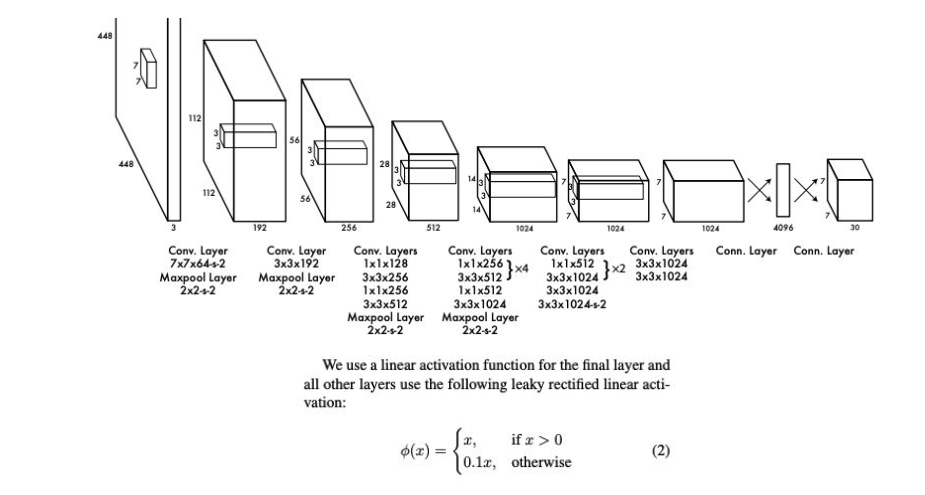

## 网络结构

## 网络结构示例代码
```py
def conv_1_3(x, f1, f2, r=1):
   for _ in range(r):
     x = Conv2D(f1, 1, padding='same', activation=activation)(x)
     x = Conv2D(f2, 3, padding='same', activation=activation)(x)
   return x


 input = Input(input_shape)

 x = Conv2D(64, 7, strides=2, padding='same', activation=activation)(input)
 x = MaxPool2D(2, strides=2, padding='same')(x)

 x = Conv2D(192, 3, padding='same', activation=activation)(x)
 x = MaxPool2D(2, strides=2, padding='same')(x)

 x = conv_1_3(x, 128, 256)
 x = conv_1_3(x, 256, 512)
 x = MaxPool2D(2, strides=2, padding='same')(x)

 x = conv_1_3(x, 256, 512, 4)
 x = conv_1_3(x, 512, 1024)
 x = MaxPool2D(2, strides=2, padding='same')(x)

 x = conv_1_3(x, 512, 1024, 2)
 x = Conv2D(1024, 3, padding='same', activation=activation)(x)
 x = Conv2D(1024, 3, strides=2, padding='same', activation=activation)(x)

 x = Conv2D(1024, 3, padding='same', activation=activation)(x)
 x = Conv2D(1024, 3, padding='same', activation=activation)(x)

 x = Dense(4096, activation=activation)(x)
 output = Dense(n_outputs)(x)

 model = Model(input, output)
```
